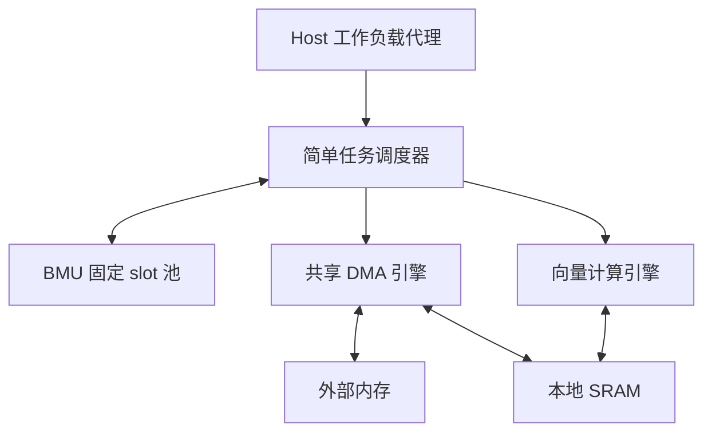

# ESL测试系统规划：Mini Pipeline基础案例与多AXI端口SRAM性能案例

**本文规划基础与性能专项测试案例，不提供或声称已经实现完整 ESL 系统。** 用它给未来的 esl-development-suite 下任务，检查 Skill 能否正确复用 esl_repo 的组件，完成建模、观察和架构比较。

选用“外存输入 → DMA 搬入 → 向量计算 → DMA 回写”的小系统。算法刻意简单，让开发注意力落在组件复用、数据流、资源竞争、buffer 生命周期和性能解释。

本文第1–13节保留Mini Pipeline基础案例；第14节为独立的多AXI端口SRAM Controller性能验收案例；第15节用不同工作入口检验subskill路由。后者属于明确的performance用途，不要求先完成RTL或信号级AXI VIP。

当前 Python 实现位于 reference/legacy_python/examples/mini_pipeline；下文未来 SystemC mini_pipeline 是独立待办，不能以旧实现代替目标交付。

## 1. 这个项目要回答什么

主要架构问题：**一个计算引擎配一套共享 DMA，单缓冲改为双缓冲后，能隐藏多少搬运时间？剩余瓶颈在哪？**

随后选择性回答：增加 DMA 带宽是否有效；增加计算 lane 是否有效；SRAM bank 冲突能否被观测；少量 buffer 或队列会怎样限制流水；错误发生时是否能可靠结束。

不需要 CPU 指令集、操作系统、NoC、真实 DDR 时序、复杂 Tensor 算子或 RTL 联仿。Host 只是工作负载提交代理。

## 2. Repo 与 Skill 各自承担什么

| 对象 | 本测试项目中的职责 |
|---|---|
| Repo | 提供 Memory、DMA、BufferPool/BMU、TaskGraph、ComputeShell、Queue、Resource、观察器和测试工具 |
| Repo | 提供 pipeline_system、compute、parameter_sweep 等模板，以及生成/构建/运行资产 |
| Repo 的 examples/mini_pipeline | 保存未来实现的具体配置、简单功能回调、输入生成/oracle、场景和示例 README |
| Skill | 选择组件、解释简化假设、组织任务依赖、定义对照实验、调用工具和分析结果 |
| 本文 | 给开发者和 Skill 的项目任务书；不是 Skill 内置的模型源码或模板副本 |

测试重点：系统组合过程中不应重新实现一套 Queue、SRAM、trace、metrics 或 BMU 分配器。缺少通用能力时补回 Repo，而不是写成系统私有实现。

## 3. 系统构成与连接

调度器接收每个 chunk 的 load、compute、store 三个任务和依赖关系；DMA 的搬入、搬出共用一个服务引擎。BMU 控制有限 slot 的占用。所有模块接入同一观察器，图中省略观察连接。

| 模块 | 必需能力 | 本示例的简化 |
|---|---|---|
| Host | 提交 chunk 任务，接收最终结果 | 提交开销为零，不执行真实 CPU 指令 |
| Scheduler | DAG 依赖、ready queue、失败传播 | 不抢占，不做复杂优先级/QoS |
| BMU | 分配/释放固定 slot，无空间等待 | 不做分页、搬迁和一般动态堆 |
| DMA | 实际 copy、输入输出竞争、完成事件 | 默认高层命令，不从内存 fetch descriptor |
| Compute | int16 数据变换、有限执行能力 | 单任务执行，不建内部 RTL pipeline |
| External Memory | 真实字节存储、边界检查 | 不称为精确 DDR 模型 |
| Local SRAM | 真实字节存储；扩展时支持 bank | 基础 profile 不计 SRAM 时间 |
| Observe/Bench | 计数、时间线、oracle、比较 | 本地文件，不需要 Web 服务 |

## 4. 计算任务与数据布局

计算：

\[
y_i = \operatorname{clip}_{[-32768,32767]}(2x_i+3)
\]

输入和输出都为有符号 int16，小端编码；中间计算至少采用 int32，之后饱和转换。禁止在 int16 中先溢出再饱和。

| 参数 | 默认值 |
|---|---|
| 样本数 N | 16,384 |
| chunk 大小 | 256 个元素 |
| chunk 数 | 64 |
| 单 chunk 输入/输出 | 各 512 B |
| 总输入/总输出 | 各 32 KiB |
| 外存大小 | 256 KiB |
| 输入起始地址 | 0x0000 |
| 输出起始地址 | 0x10000 |
| SRAM 大小 | 8 KiB |
| 每 slot 大小 | 1 KiB：512 B 输入 + 512 B 输出 |
| 基线/对照 slot 数 | 1 / 2；最大配置 8 |

输入使用确定性公式 `x[i] = ((17*i + 5) % 65536) - 32768`，覆盖正负及饱和情况。oracle 使用独立整数表达式，不调用 Compute 的功能函数。

输入与输出区无重叠；输出外围添加 guard 区，检查越界写。主场景整除 chunk；边界测试额外使用 1、255、257 个元素，末块 DMA 长度按实际元素数，不搬运未定义尾部数据。

## 5. 每个 chunk 的生命周期

1. 原子获取一个 slot，其中包含输入区和输出区；没有空 slot 则等待。
2. 提交 load：外存输入 → slot 输入区。
3. load 完成且数据可见后，compute 才可开始。
4. compute 读取该 slot 输入，产生输出；完成时输出对 DMA 可见。
5. store：slot 输出区 → 外存对应输出区。
6. store 成功完成后，标记 chunk 成功并释放 slot。

slot 地址可采用：`input_offset = slot_id * 1024`，`output_offset = input_offset + 512`。它们属于 SRAM 地址空间，不与外存地址混用。

必须原子获取输入/输出资源，避免两个 chunk 各拿到一半空间后互等。Slot handle 带 generation/epoch；活动 DMA/Compute 仍引用存储时，取消或复位不能立即把该存储分配给新任务。

任务结构是固定的小 DAG；不把每个元素变成独立任务。全部64个chunk在tick 0提交到预加载任务表；该表是工作负载输入，不宣称模拟有限硬件提交队列。BMU按chunk ID递增接纳，空闲slot选最低ID。未获取slot的chunk不占DMA/Compute执行队列。有限硬件提交带宽/队列不在本profile范围内。

## 6. profile与类别：同一行为核心，不同时间策略

基础系统用途为 `[behavioral, performance]`。提供一个轻量 `functional` profile用于只检查数据/状态：timing_model=untimed、data_mode=full_data、interface_mode=command、transport=direct。它复用现有核心，不引入第二套实现；不输出目标吞吐。

主验收使用pipeline_analytic：timing_model=resource_contention、data_mode=full_data、interface_mode=command、transport=direct；能力包括data_transform、finite_buffers、shared_dma_contention，**不含bank_contention**。外存/SRAM为零时间数据服务；SystemC负责聚合资源时间，direct指类型化接口调用，并非绕过资源计费。

memory_resource为可选资源profile，增加bank_contention及显式内存请求。寄存器扩展增加software_visible用途；本示例不要求microarchitecture/cycle_accurate模型。基础不实现traffic_only，选择它应被能力校验拒绝。

以上profile仅为规划，待实现后才能在Repo标available。

### 6.1 基础 profile：pipeline_analytic

这是最先开发的 profile，用于测试调度、双缓冲、资源计时与观察器。以 1 ns 为一个统一 tick；下列周期是示例模型参数，不是实际芯片频率预测。

| 资源 | 服务规则 |
|---|---|
| DMA | 搬入搬出共享单个非抢占 server；每个方向每 chunk 服务时间 `4 + ceil(bytes/32)` ticks |
| Compute | 单个非抢占 server；每 chunk 服务时间 `4 + ceil(elements/8)` ticks |
| 外存/SRAM | 有真实数据与边界检查，但不再附加时延 |
| Host/Scheduler/BMU/Event | 零时间控制，保留资源与依赖限制 |

DMA 的聚合时间已涵盖本 profile 的搬运假设。若又在 MemoryPort 上收取一次带宽延迟，就会重复计时。

默认每 chunk 的 load=20 ticks、compute=36 ticks、store=20 ticks。Compute 在开始时读取已完成 load 的数据，在完成时提交输出；DMA 写操作在该服务结束时才可见。

**确定性调度规则：**每个资源等待集合默认深度4，服务中项不计入深度。Scheduler只判断依赖，并按store优先、同类chunk ID升序将就绪命令提交；Compute同类按chunk ID。接受后由资源端统一仲裁：DMA在已接受等待集合中store优先，否则load，同类ID升序；Compute取最小ID。已接受load不被新store挤出，活动服务不抢占。容量满时未接受项留在Scheduler，资源下一次释放容量后重试。

每个tick先批量处理全部完成及数据提交/释放，再更新依赖和slot分配，随后接纳命令，最后仲裁并开始服务。服务结束不会在同tick清理完之前立即递归启动下一项。零时控制通过delta调度完成；等待容量必须有状态变化事件，禁止零时忙轮询。depth=1的背压场景允许与默认深度有不同性能。

### 6.2 可选 profile：memory_resource

仅在需要测试 SRAM/带宽模型时增加：拆分 DMA 内存事务，由外存带宽和 SRAM bank 资源负责服务时间；Compute 的取数、运算、写回也经显式内存请求连接。

此 profile 保留 DMA 每条命令的 setup，但删除 pipeline_analytic 中聚合的 `bytes/32` 搬运时间，避免重复计算。同一 ByteStore 保持数据一致。

Compute 可先采用 load→execute→store 三段模型，不要求一开始模拟细粒度边读边算。若未来增加重叠，另列策略参数。

本 profile 的预期周期由所选资源合同确定，不能套用下一节的精确周期。只在该 profile 中分析 SRAM bank 数的影响；基础 profile 中改变 bank 不应改变时间，也不能据此断言 bank 没价值。

## 7. 基础 profile 的可解析预期

以下是根据第 6.1 节规则推导的**测试预期，不是已经运行得到的仿真结果**。

### 7.1 单 slot

每 chunk 严格 load→compute→store→释放，总时长为：

\[
T_1=64\times(20+36+20)=4864\text{ ticks}
\]

DMA 总忙碌时间 2,560 ticks，Compute 总忙碌时间 2,304 ticks；二者无重叠，空闲控制开销为零。

### 7.2 双 slot

先看前几个 chunk 的资源安排，以便调试事件与调度：

| 区间 ticks | DMA | Compute |
|---|---|---|
| [0,20) | load 0 | idle |
| [20,40) | load 1 | compute 0 的前半段 |
| [40,56) | idle | compute 0 的剩余部分 |
| [56,76) | store 0 | compute 1 的前半段 |
| [76,92) | load 2 的前半段 | compute 1 的剩余部分 |
| [92,96) | load 2 的剩余部分 | idle |
| [96,116) | store 1 | compute 2 的前半段 |

此后中间稳态 chunk 按 40 ticks 节拍推进，最后一个 chunk 排空。按规定调度，对于本例 64 个 chunk：

\[
T_2=40\times64+32=2592\text{ ticks}
\]

该式仅用于这里的完整 chunk、两个 slot、指定延迟和调度规则；改变参数后需重新推导。chunk_count=1（即256个元素）时仍为76 ticks；本文N始终表示元素数。

预期 speedup=`4864/2592≈1.88`；DMA 与 Compute 忙碌总量仍分别为 2,560 和 2,304 ticks。这个场景不会让共享 DMA 的搬入与搬出互相重叠。

不依赖具体调度的资源下界为：

\[
T\ge\max(64\times40,64\times36)=2560\text{ ticks}
\]

若基础场景结果小于 2,560 ticks，优先检查重复服务、漏计搬出时间或错误地将同一 DMA 变成两个独立资源。

## 8. 需要观察的内容

| 观察对象 | 指标 | 用途 |
|---|---|---|
| 全系统 | 总 ticks、samples/tick、成功/失败 chunk | 比较真实端到端收益 |
| DMA | load/store bytes、busy、等待、队列峰值 | 判断共享搬运资源限制 |
| Compute | busy、等输入时间、执行数 | 判断是否喂不饱或成为瓶颈 |
| BMU | peak slots/bytes、alloc wait、未释放数 | 判断容量与生命周期 |
| Memory | 地址错误、实际字节数；可选 bank wait | 检查数据通路与冲突 |
| Trace | load→compute→store 关联与重叠 | 解释等待、竞态和排空 |

时间线至少有 DMA、Compute、chunk 生命周期与 BMU occupancy。每个 chunk 共用关联 ID；DMA 单 server 不应出现服务区间重叠。

外存读 32 KiB、外存写 32 KiB，外存总流量 64 KiB；SRAM load 写、compute 读、compute 写、store 读合计 128 KiB。输出有效数据为 32 KiB。三个量不同，不应混成同一个“吞吐字节数”。

观察采用whole_run：从tick 0至最终store完成并处理完同tick资源释放；事件计数包含最后一次完成，时间积分不额外增加tick。队列平均深度使用时间积分。off/counters/trace三档不得改变数据结果与目标仿真时长；off只保留最小运行/正确性输出，性能指标标NOT_RUN，不要求与开启采集时有相同指标文件。

## 9. 最小测试场景

| ID | 场景 | 明确判据 | 验证组件 |
|---|---|---|---|
| T01 | 单 chunk、单 slot | 输出逐元素一致；76 ticks | Command、DMA、Compute、oracle |
| T02 | 64 chunk、单 slot | 数据正确；4864 ticks；无 overlap | Scheduler、BMU、时间计费 |
| T03 | 64 chunk、双 slot | 数据正确；2592 ticks；有 overlap | 依赖、共享资源、观察器 |
| T04 | slot=1/2，DMA queue=1 | 不丢/重复任务；队列不越界；结果正确 | retry/backpressure |
| T05 | N=1/255/257 | 正确处理尾块和 guard 区 | 模板参数/边界处理 |
| T06 | slot 超过 SRAM 容量；queue=0 | 仿真前拒绝并说明字段 | 配置校验 |
| T07 | 指定 chunk 的 load 失败 | 该 chunk 不执行 compute/store；进入失败终态 | 错误传播 |
| T08 | 指定 chunk 的 store 失败 | 不报成功；在活动访问排空后回收 slot | 完成语义、资源清理 |
| T09 | 在有活动任务时取消/复位 | 无旧 epoch 污染、无悬挂引用；后续新运行正确 | 生命周期 |
| T10 | 观察 off/counters/trace | 结果和目标时间完全一致 | 观察器旁路性 |
| T11 | 重复同配置/seed | 数据、调度、指标一致；宿主时间可不同 | 可重现性 |
| T12 | 修改一个期望输出使 oracle 故意失败 | 报首个差异，不能标 PASS | 测试工具可信度 |

错误用例不强求整批输出正确：失败 chunk 的输出区可能保持旧值或部分完成，按内存服务合同解释；成功 chunk 必须正确，失败 chunk 不得计入成功吞吐。为简化，基础系统采用 fail-fast：任一 chunk 失败后停止接纳新 chunk，取消尚未开始任务，排空活动操作并以失败结束。

T09 不要求回滚已完成内存写入。新测试应重新初始化输入/输出，slot 仅在旧访问排空后重用；reset 模式的这个约定必须显式实现。

负向场景有两层结果：被测run因注入故障/错误oracle而overall_status=FAIL；若harness验证预期错误、诊断和清理均符合要求，则该测试test_status=PASS。T06同理验证预期配置拒绝。禁止为让测试通过而篡改被测run状态。

超时使用两个限额：sim ticks 与宿主 wall time。超时报未完成 task、持有 slot、等待资源和最后事件，不能把超时点作为一个高吞吐结果。

## 10. 参数探索：少量点就能测试方法

第一轮只跑以下基线/对照，其他条件不变：

| 实验 | 改动 | 应分析的问题 |
|---|---|---|
| E0 | slot=1 | 串行基线 |
| E1 | slot=2 | DMA/Compute 重叠收益 |
| E2 | slot=4 | 更多 buffer 是否仍有收益、是否趋于资源下界 |
| E3 | slot=2，DMA 16 B/tick | 搬运变慢后等待是否转移 |
| E4 | slot=2，DMA 64 B/tick | Compute 是否成为主要限制 |
| E5 | slot=2，Compute 4 elements/tick | 计算变慢后 DMA 是否更多空闲 |
| E6 | slot=2，Compute 16 elements/tick | 更快计算是否被共享 DMA 限制 |

只对 E0/E1 使用第 7 节给出的精确预期。其他点重算其时间规则并检查资源下界，不能要求所有参数变化都带来线性收益或任意调度下严格单调。

交付一张表：实际配置、正确性、总周期、samples/tick、DMA/Compute 利用率、BMU 峰值、相对 E0 的 speedup、失败原因。解释一次“加资源但收益很小”的例子，比堆几十张图更有价值。

## 11. 可选扩展题：逐项测试更多 Repo 资产

### 11.1 Banked SRAM 微基准

在 memory_resource 相关组件可用后，独立运行一个可解析微基准：2 个 initiator，各 8 笔 16 B 访问；每 bank 单服务端口、每笔 1 tick、无额外启动/响应开销，全部在tick 0提交，队列足够容纳。使用只读请求和预初始化存储，避免同址写覆盖引入无关数据竞争。

映射采用 `bank=floor(offset/16)%banks`，banks=2：

- 同 bank：两个源都访问 offset=`32*k`，最后一笔于 tick 16 完成。
- 不同 bank：源 0 访问 `32*k`，源 1 访问 `32*k+16`，最后一笔于 tick 8 完成。

这是 BankedMemory 的独立组件测试，不要求系统大负载也恰好获得 2 倍提升。随后再把 bank 模型接回 pipeline，观察端到端差异。

### 11.2 最小寄存器/IRQ 前端

给 Host 提交方式增加可选寄存器入口，业务执行核心保持复用：

| Offset | 寄存器 | 语义 |
|---|---|---|
| 0x00 | CONTROL | 写 bit0=START；busy 时拒绝再次启动 |
| 0x04 | STATUS | bit0 BUSY，只读；bit1 DONE、bit2 ERROR 为 W1C |
| 0x08 | LENGTH | RW，样本数；仅 idle 可修改 |
| 0x0C | IRQ_ENABLE | bit0 DONE、bit1 ERROR 的使能 |

所有寄存器 32 bit、小端、自然对齐；未定义地址报错；未定义位读零/写忽略，写入只作用于启用字节。START 读取为零。硬件 set 与 W1C 同时发生采用 set 优先。新接受的 START 清除旧 DONE/ERROR 并置 BUSY；终结清 BUSY 并置对应状态。

IRQ 为 `(DONE & en_done) | (ERROR & en_error)`，清状态后重新计算电平。寄存器 reset 全零；此测试配置的输入/输出地址固定，不再扩展完整 DMA 表。

测试 W1C、byte strobe、mask/unmask、busy 再启动、未定义地址。用该前端与命令模式得到相同输出；若寄存器访问设为零时延，核心目标执行时间也应一致。

### 11.3 descriptor 前端

只在要测试 DescriptorCodec 时增加真实内存 descriptor 读取；定义字段布局和来源，记录额外内存流量。命令模式与 descriptor 模式调用同一 DMA 执行核心。

不要求把所有这些扩展做完才能使用基础系统。未实现项记录为未覆盖，不能阻塞主问题的探索。

### 11.4 用途/profile一致性小检查

基础实现额外用同一小输入分别运行functional和pipeline_analytic，比较最终数据、完成次数和失败语义；不要求全局事件顺序/完成时刻相同。functional不生成目标吞吐。声明bank分析、寄存器兼容或traffic_only时，能力不足必须拒绝或明确未覆盖，不能从profile名字猜测。

## 12. 未来实现应交付什么

资产应放 `esl_repo/examples/mini_pipeline/`，预计包括系统/实验配置、输入与 oracle、少量计算 callback、测试场景和简短 README；公共能力回到 common/models/templates/tools，而不是藏在 example 中。

每次运行由工具生成 run、metrics、checks、摘要与可选时间线。用户不必手工填写 RTM、Gate 或多份过程文档。

**基础完成标准：**命令模式的单/双缓冲可运行，数据与解析时间吻合，性能观察能解释收益，容量/错误场景可诊断，配置可以重复运行。Bank/寄存器/descriptor 是进一步检验相关组件的扩展题。

## 13. 可直接交给未来 Skill 的测试任务

> 请基于 esl_repo 已有模型与公共组件，按照 [esl_testcase.md](esl_testcase.md)（Mini Pipeline 系统测试示例）实现 examples/mini_pipeline。先完成 pipeline_analytic 的命令模式、真实 int16 数据、单/双 slot 和公共性能观察，复用 DMA、BufferPool、TaskGraph、ComputeShell 与观察器。运行 T01–T12 中适用的基础测试和 E0–E6，对比数据正确性、周期、资源利用率、buffer 占用与时间线。缺失的通用能力补到 Repo，Skill 只负责方法与编排。不要实现 CPU/OS/完整 DDR/NoC；寄存器、descriptor 与 bank 扩展暂不作为基础完成条件。所有结果区分解析预期和实际测量，报告已运行、失败与未覆盖项。

这段是后续开发时使用的任务说明；本次交付仅为规划 Markdown，没有执行其中的 ESL 开发任务。

## 14. 多AXI端口SRAM Controller：性能导向验收案例

### 14.1 定位与必须回答的问题

案例名 `multiport_sram_perf`，未来资产放Repo的 `examples/multiport_sram_perf/`。此节同样只是规划，不提供完整ESL实现。

它作为Performance-Oriented ESL的专门验收对象：比较多入口请求经Router/交织映射访问共享SRAM时的吞吐、尾延迟、公平性、HOL阻塞和背压传播。Mini Pipeline通过不能替代此案例通过；反过来，此案例未实现不阻塞轻量基础工具投入使用。

模型类别为performance；支持真实数据和数据比对时同时列behavioral。默认profile为 `sram_resource`、timing_model=resource_contention。不自动声明microarchitecture或cycle_accurate，更不声称完成AXI信号级协议验证。

### 14.2 结构与基础配置

数据路径：多端口AXI事务源 → 每端口接纳/队列 → 事务拆分与地址交织 → Router/仲裁 → SRAM banks → 读数据拼装/写完成聚合 → 每端口响应队列。

| 参数 | 基础值/语义 |
|---|---|
| AXI Slave端口数 | 8，可扫4/8/16；对应独立事务源 |
| 每端口数据宽度 | 1024 bit，即128 B/完整beat |
| 输入/输出端口速率 | 每端口每tick最多1个完整beat；读响应与写数据分别受自己的端口容量约束 |
| 时钟 | 单时钟，1 ns/tick；不分析CDC |
| 总SRAM容量 | 1 MiB；扫bank数时保持总容量不变 |
| bank数 | 16，可扫8/16/32 |
| bank数据宽度 | 128 bit，即16 B/服务单元 |
| bank端口 | 每bank一个读写共享服务端口，1个16 B片段/tick；服务延迟1 tick |
| 地址交织 | line_bytes=16；bank=floor(offset/16)%banks；bank-local地址另算 |
| 事务 | 对齐INCR，1/4/16 beats；事务长度按beat bytes×beats计算 |
| 每入口outstanding | 默认8，按未收到完整响应的事务数计，不按片段数计 |
| 每bank等待深度 | 默认8个片段，服务中项另计 |
| Router | 基线为理想非阻塞路由，显式受入口速率、目标容量和仲裁约束；切换共享路由资源作对照 |
| 仲裁 | 每bank对源端口round-robin；同源候选按序，按片段服务推进轮转 |
| 每端口响应等待深度 | 默认8个响应beat；B响应另设有限项数，不能用无界缓存隐藏背压 |

最少复用：ByteStore、BankedMemory、Queue、Resource、Arbiter、MemoryPort、TrafficGenerator、Observe与Bench。新增模型只写端口事务接纳、拆分/重组、Router策略和ordering逻辑。

### 14.3 AXI抽象边界：必须保留什么

请求元数据至少含port_id、transaction_id、AXI ID、读写、地址、bytes_per_beat、beats、写strobe、到达时间；合法范围由配置校验。

- AW/AR/W/R/B不是逐信号仿真，但读写流量、端口服务能力、outstanding、同ID响应顺序和返回背压必须保留。
- 基础写事务仅在地址与完整数据可用后进入事务接纳；此后仍按端口beat速率注入。AW/W独立偏斜、W交织细节不在基础范围。
- 先按AXI beat，再按16 B line拆分；1024 bit beat会占8个bank片段，不能视作一次16 B访问。
- 写完成须等待全部有效片段提交；同ID同方向保持响应顺序，不要求不同ID顺序；不默认规定读写跨通道的同ID顺序。
- 支持非一致性物理地址。基础INCR不跨4 KiB边界；越界/不支持burst类型在运行前或接口处明确拒绝。WRAP、exclusive、cache coherence不纳入本案例。
- 对同址读写，用bank服务顺序定义取样与提交；工作负载若要特定先后必须建立依赖，不能由oracle猜硬件顺序。
- 整笔事务不预占所有bank。接纳前检查完整地址范围；逐片段进入有限队列并保持父子ID，全部片段完成后才能结束父事务。

这是AXI事务语义约束，不是自定义字段等同于AXI协议全覆盖的声明。接TLM时由显式扩展/适配携带字段；接VIP/RTL留作后续。

### 14.4 容量与时间必须真实约束

入口outstanding、待发片段、bank queue、响应重组buffer、返回queue都有限，并计入配置和观察。基础按每入口outstanding×最大事务长度分配有上限的重组空间，或采用显式credit方案；不能用宿主无限vector绕过硬件容量。

返回阻塞时保留未完成事务的outstanding与重组资源，并最终向入口传播背压。最小实现允许bank完成后暂存在已预留的有限重组区，不要求返回阻塞立即冻结所有bank；报告必须反映这段吸收容量。

对照FIFO与per-bank VOQ时，两者入口总存储预算保持相同，说明credit共享/划分；否则不能把更大buffer带来的收益归因于VOQ。round-robin的公平性只对持续eligible、目标持续可服务、返回端持续接收的请求作保证；背压端口不能被当作仲裁饥饿。

默认宽度下8入口总峰值为1024 B/tick，16 banks总服务能力为256 B/tick。因此稳态读写合计的SRAM有效字节吞吐上界为256 B/tick；不能把读与写分别按256后相加。有限测量窗口可能先排空历史响应，资源上界优先按bank实际服务量检查；端到端退休吞吐的稳态窗口还需说明起止在途量。

Router或响应路径增加延迟/限速时单独指定owner；不在bank与Router重复计同一段传输。观察off不能改变资源调度。

### 14.5 必备负载与实验

| ID | 负载/实验 | 主要目的 |
|---|---|---|
| M0 | 16 B窄读微基准，8端口各1笔，无额外路由/返回延迟 | 验证交织和bank并行的解析边界 |
| M1 | 8端口连续、均衡读；再跑均衡写 | 测饱和吞吐、入口/返回带宽与重组 |
| M2 | 地址stride形成热点与均匀分布对照 | 测bank冲突、排队与有效带宽 |
| M3 | 只读/只写/读写混合，相同总有效字节量 | 测共享读写端口竞争 |
| M4 | 一个入口的热点请求后接冷bank请求；其余入口可用 | FIFO/VOQ对照HOL；保持总队列预算相同 |
| M5 | 固定总容量，扫8/16/32 banks与outstanding=1/8/16 | 找带宽/并行/队列瓶颈，不预设线性提升 |
| M6 | 单入口返回端暂停固定100 ticks后恢复 | 验证有限响应buffer、背压与恢复 |
| M7 | 持续eligible的8端口争同bank | 检查round-robin无饥饿与分配份额 |
| M8 | full_data：写入唯一地址图样后依赖完成再读取 | 检查数据、strobe、拆分重组与ID顺序 |

M0关闭额外传输延迟，窄读的一个16 B请求仅消耗一个bank服务单元：8请求同bank最后完成于tick8；分别映射8个bank时最后完成于tick1。此为隔离资源fixture，不套用于1024 bit完整beat或真实Router。

M1–M7可用与数据值无关的closed-loop事务源：每源受outstanding和背压约束，完成后才能补充请求；不能用固定时间trace绕过限额。统一固定seed、总字节量和预先定义的warm-up/测量/排空窗口。记录注入率、在途量和响应速率，不仅报告退休吞吐。

traffic_only可作为此案例扩展模式，要求地址/长度/读写/依赖不依赖实际数值；先以M8的full_data验证基础行为，再将同一数据无关短负载两种模式对照事务轨迹。数值检查在traffic_only仍不适用。

### 14.6 专项验收条件

- 上述M0–M8均实际运行并保留配置、结果与异常点；基本参数组合不支持时必须明确，不悄悄换模式。
- M0吻合1/8 ticks解析结果；完整1024 bit beat拆为8片段；1/4/16 beats的片段数与有效字节守恒。
- M8按字节比对、strobe与guard检查通过；同ID同方向响应无乱序、父事务无提前完成；不同ID不强迫实现乱序。
- M1–M5满足每bank、入口、Router与响应资源各自上限。饱和均衡负载距离256 B/tick上界的差距可由idle、排队、限制或排空解释，不硬性要求达到任意百分比。
- M6无容量越界或事务丢失，outstanding最终归零，恢复后完成全部已接受事务；观察到背压传播及吸收容量。
- M7在无背压、每端口最多一个待选片段且持续eligible条件下，任一端口两次grant间至多7次其他端口grant；该限制只用于此受控fixture。
- 指标包含每端口吞吐/P95延迟、每bank利用率/冲突等待、HOL等待、Router占用、响应阻塞、outstanding与buffer峰值。瓶颈结论必须有参数对照支持。

此案例的验收证明performance建模与分析能力，不证明最终RTL性能误差。RTL校准另行按参考配置与负载制定误差预算。

## 15. 按工作类型测试：同一资产，不同起点

以下是未来交给 Skill 的测试任务，不是本轮执行请求。W 路由与方法判据由 esl-development-suite 管理；工程验收编号见本仓 esl_todo.md。各任务使用隔离分支/项目目录或仅暴露指定资产的fixture，不删除真实仓库已有模型来制造缺失，避免“从零开发”覆盖已有模型；基础/专项数值以本文前述合同为准。

| 题号 | 起点与请求 | 预期路由/关键行为 | 检查证据 |
|---|---|---|---|
| J01 | 库中只有公共Memory/Command/Queue，要求“做一个DMA行为模型” | W01；规划/开发/负载/验证；不自动增加CSR或RTL | 正常拷贝、guard、越界/重叠/零长度、完成唯一；untimed不报吞吐 |
| J02 | J01已有DMA，要求“支持共享搬入搬出资源与排队” | W03；增加performance profile，复用核心 | 同输入跨profile数据/终态一致；两个命令资源串行且等待可观察；无重复计时 |
| J03 | 所有组件已available，要求“搭Mini Pipeline” | W04；组合、负载、验证 | 选择表/配置、T01/T02/T03；不复制或重写DMA/BMU/Queue |
| J04 | 仅缺向量计算hook，要求搭同一系统 | W05；保留已搭部分，只补缺口后返回组合 | 缺口定位正确；补hook后端到端通过；公共观察器不重写 |
| J05 | 已有系统，只要求比较单/双缓冲 | W09；分析按需调用负载/验证 | E0–E6或用户要求的明确子集；正式基础验收仍需E0–E6全部通过 |
| J06 | 已有profile不支持bank竞争，却要求“比较16/32 banks” | W03/W07或W05；定位能力缺口，不直接画性能曲线 | 选memory_resource/专项profile或明确尚缺；不在pipeline_analytic上作bank结论 |
| J07 | 提供ByteStore/Queue/Observe，要求“建立多AXI SRAM性能模型” | W02；建设有限资源与事务模型，再验证/分析 | M0–M8、MP01–MP07；与Mini Pipeline独立判定 |
| J08 | 专项模型已有，只要求“补热点/HOL负载” | W08；不修改DUT来制造预期结果 | 负载自检、相同总容量FIFO/VOQ配置、可重放seed；执行方式明确 |
| J09 | 一份返回背压后卡住的失败run | W10；验证定位，按需开发修复再回归 | 最小复现、等待/持有关系、容量清理；不能只延长timeout |
| J10 | 要求DMA寄存器/descriptor前端 | W06；复用执行核心，对齐上游或明确探索ABI | 本文§11.2/11.3；fetch访问及开销如实记录 |
| J11 | 要求替换聚合访存为细粒度bank模型 | W07；按需组合/开发，移除旧时间收费 | 跨profile数据/终态一致、计时owner变化明确，不套用2592 ticks |
| J12 | 给匹配参考，要求校准 | W11；先对齐、再拟合、保留独立验证 | 参数和误差报告；人工fixture标明方法测试，不能宣称RTL准确率 |
| J13 | 给一个模型候选，要求导入/登记 | W12；来源/依赖/语义核对，按需适配验证 | planned/available区别；不兼容候选被拒绝或显式适配 |
| J14 | 两个模型重复统计queue占用，要求抽公共组件 | W13；工程资产回Repo | 独立积分fixture及消费者回归；Skill不存源码 |
| J15 | “只修改上述规划，不实现ESL” | W14；仅文档检查 | 指定文档更新，配置示例自洽，无虚构执行结果 |

J01/J02可使用独立小型DMA单测，不必先搭系统。J03与J04刻意分别测试“纯复用”和“补缺后组合”，避免只能在熟悉的完整示例上成功。J06是能力选择测试；只有新增后端并实际运行，才算性能比较完成。

### 15.1 独立调用与复用证据

每个subskill至少通过一次独立调用方法检查：直接verification不先重写需求；直接analysis可以读取现有run；直接composition能发现缺口；直接calibration缺参考时明确阻塞。

检验已有证据能否复用时，改变无关README与改变bank映射分别执行：前者只检查文档，后者使相关性能证据失效。已通过Mini Pipeline不能替代新DMA单模型行为测试，也不能替代SRAM专项。

### 15.2 实验报告的最小形式

一页摘要列出工作类型、选中资产/profile、输入与实际配置、执行方式（真实运行/固定fixture/未运行）、检查结果、证据路径和限制。正式系统测试必须真实运行；fixture只能证明路由/诊断/状态处理方法。失败修复保留旧run，不能覆盖成成功。
