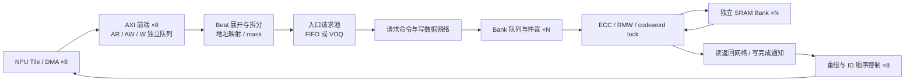

# NPU SRAM Controller：候选硬件架构与探索变量

日期：2026-09-18。状态：架构提案，尚未实现、仿真或校准。

修订：本轮补齐资源生命周期、时序、顺序/死锁、宏写掩码、参数合法性与实验归因；审查发现及验收要求见 §11–§15。文档定义的是待实现合同，不能替代实现验证。

本文细化 [ESL 实施规划](npu_sram_ctrl_esl_plan.md)，先定义实际比较的硬件结构及变量，再据此开发模型。所有频率、流水深度和优化阈值均为实验假设；推荐建模起点不等于推荐最终硬件。

## 1. 架构问题与固定边界

目标：在固定容量、接口和资源预算下，寻找使闭环 NPU workload 完成时间最短、且尾延迟与最坏退化可接受的共享 SRAM 控制器。最终输出性能优先、资源优先、折中三个 Pareto 候选，并说明适用的数据布局。

第一轮固定：8 个 AXI4 Slave，数据宽度 1024 bit，8 MiB **有效数据容量**，统一时钟，名义 1 GHz。SRAM 是软件管理的共享 scratchpad，无 cache/coherence。端口可以访问整个合法地址空间；“本地 group”只决定路由距离，不改变共享地址含义。

硬件参数、软件布局和激励参数分开保存。换 Bank 数时不自动换 workload 地址；编译器着色/padding 属于单独的联合优化实验。

| 层次 | 对象 | 是否作为硬件寻优变量 |
|---|---|---|
| 接口边界 | 8 ports、1024-bit AXI、8 MiB | 主实验固定；扩展实验才能改变 |
| 存储组织 | Bank 数、word 宽度、1RW/1R1W | 是 |
| 地址组织 | stripe、modulo/XOR、region、group interleave | 是；每次运行初始化时确定 |
| 数据通路 | flat/hierarchical、链路宽度、流水和 credit | 是 |
| 调度与暂存 | FIFO/VOQ、队列、outstanding、仲裁 | 是 |
| 可靠性 | ECC 引擎、RMW、scrub | 是；相同可靠性等级内比较候选 |
| NPU/软件 | 算子 shape、tile、数据布局、复用和 compute rate | 激励/约束，不能混入纯硬件收益 |

## 2. 公共硬件架构

各可替换模块具有固定合同：

| 模块 | 硬件状态与资源 | 必须保留的性能行为 |
|---|---|---|
| AXI frontend | AR/AW descriptor、W FIFO、R/B outstanding | AW/W 独立到达；W 按 AW 顺序关联；满时反压 |
| Splitter/mapper | 地址计算流水、fragment 描述符、mask | 跨 stripe/Bank word 切分；命令发射数有限 |
| Ingress queue | 固定大小请求池和可选 VOQ 索引 | FIFO HOL、VOQ 旁路、池耗尽；VOQ 不隐式扩大池 |
| Fabric | 命令槽、数据通道、pipeline、有限 credit | 入口/出口/共享链路竞争；请求与返回分别计费 |
| Bank controller | 等待队列、RR 状态、年龄、RMW lock | Bank II 与 latency 独立；1RW 读写竞争 |
| ECC | encode/decode pipeline、实例、修复等待队列 | 无错读取也占用 decode；部分 codeword 写占用 RMW |
| Response | fragment bitmap、beat buffer、ID order table、B FIFO | 每 beat 重组，同 ID 顺序，RREADY/BREADY 回压 |

Fragment 是某次 beat 对某个 Bank word 的访问，可携带多个 ECC codeword 的 mask。ECC 子操作单独计数，不能把一个 32 B word 的四个 64-bit codeword 无条件计成四次 SRAM 访问。第一版不跨不同 beat 合并访问；同一 beat/同一 word 的合并规则固定，未来再单独探索合并硬件。

返回 credit 在 fragment 派发前预留，派发/Bank/ECC 流水也必须有有限容量。回包受阻最终阻止新派发，不能把有限 Bank 队列后接到无限完成队列。一次只获取当前 fragment 所需资源，不持有一个 Bank 等待另一个 Bank。

## 3. SRAM 组织：等带宽主实验

以下均为 1RW、II=1，每 Bank 独立寻址仲裁；word 宽度是有效数据宽度，ECC 位另算。

| 组织 ID | Bank 数 | word | 每 Bank 容量 | 每 Bank word 数 | 单个对齐 128 B beat 的最少 fragment 数 | 理想读写合计 |
|---|---:|---:|---:|---:|---:|---:|
| O8 | 8 | 128 B | 1 MiB | 8192 | 1 | 1024 B/cycle |
| O16 | 16 | 64 B | 512 KiB | 8192 | 2 | 1024 B/cycle |
| O32 | 32 | 32 B | 256 KiB | 8192 | 4 | 1024 B/cycle |
| O64 | 64 | 16 B | 128 KiB | 8192 | 8 | 1024 B/cycle |

fragment 下界只对 stripe 不引入额外切分且地址对齐时成立。宽 Bank 可能由多个 SRAM macro 锁步拼宽；这些 macro 不计为独立 Bank。

主实验以 O32 为建模基线，O8/O16/O64 为等峰值带宽对照。另设两个扩展族：固定 32 B word 增加 Bank 数，以及保持组织不变改为 1R1W。两者都改变资源/带宽预算，单独画图，不能混入交织收益。

1R1W：每 Bank 每周期最多一个读和一个写，默认同 **Bank word/row** 读写禁止同周期发射；不能仅以 codeword 不同认定宏支持并行。宏校准后可另定义更细的碰撞规则。RMW lock 和在途写依赖优先于两通道发射，II 可分别配置。名义最大读与写各 1024 B/cycle 仍需两方向网络、Bank 双入口及 ECC 同时满足；详见 §11。

## 4. 互连架构候选

### F：Flat 多 lane crossbar

所有入口可到所有 Bank，读请求命令、写命令/数据、读返回和写完成通知使用显式独立资源。读写最终竞争 1RW Bank。

O32 完整配置为每 AXI 入口最多 4 个读 fragment 命令/cycle，以及最多 4 个写 fragment、128 B 写 payload/cycle。Bank 接收端每周期最多接收一个读或写 fragment。返回方向每 Bank 提供 32 B/cycle、每 AXI 端口接收最多 4 个 fragment、128 B/cycle。

这要求多 lane 发射与收集：不能把 8 个单命令输入的简单 8×32 crossbar 当成上述配置。O8/O16/O64 的无额外入口瓶颈版本分别需要每端口 1/2/8 个 fragment 发射槽；这些 lane、仲裁器和元数据必须进入资源计数。

候选 F-full 提供上述并行度；F-limited 将每端口发射槽压到 1/2，检查减少交换资源的代价。F 的请求和返回流水各默认 2 cycles，独立扫描。F-full 的“full”只表示端口预算充足，不保证任意请求矩阵都能得到最大匹配；默认采用 §11 的有限轮次调度器，不使用免费全局最优匹配。

### H：四 group 分层互连

每 group 固定归属 2 个 AXI 入口，包含 N/4 个 Bank；每个 Bank 仍可被任意入口访问。数据路径如下：

读返回沿反方向的独立网络返回。目的 group switch 的总出口能力固定为 256 B/cycle；本地和远端流量共同竞争它，不能各拿 256 B/cycle。

| 资源 | H-full | H-balanced | H-small |
|---|---:|---:|---:|
| 每源 group 远端写上行 | 256 B/cycle | 128 B/cycle | 64 B/cycle |
| 每目的 group 远端写下行 | 256 B/cycle | 128 B/cycle | 64 B/cycle |
| 每 group 远端读返回链路，两个方向各自预算 | 256 B/cycle | 128 B/cycle | 64 B/cycle |
| 每 group 远端读/写命令槽，读写共享 | 8/cycle | 8/cycle | 8/cycle |
| 每 group Bank 聚合出口 | 256 B/cycle | 256 B/cycle | 256 B/cycle |
| 每级等待缓冲，命令/数据分列 | 16 descriptors / 512 B | 相同 | 相同 |

表内命令槽以 O32 为例；其他组织扫描 256/word_bytes 和独立受限值。每个 group switch 输入、输出均有端口限额；其全网最大合计是 4×链路预算，不能为每对 source/destination 各复制一份全速链路。

局部请求/返回各 2 cycles；远端在各自局部路径之外增加上行、group switch、下行各 1 cycle，即单传输片远端路径各 5 cycles。采用 store-and-forward：长度 L 的 payload 占用宽度 W 链路 S=ceil(L/W) 个周期；首片在边界 t 发出，具有首片延迟 P≥1 的链路在 t+P+S−1 交付完整 payload。上表流水数字已含单片传输，不再额外加一次 S；多片只增加 S−1。最后一片到达后才有资格进入下一级，仲裁/credit 等待另计。

H 的关键实验自变量是实际远端比例 0/25/50/75/100%。此比例来自地址/映射及端口归属，不能由模型随机宣布“本地命中”。先比较完全相同地址，再单独比较软件 Bank 着色。H-full 用来分离流水/拓扑效应；H-small 用来暴露共享链路瓶颈。

### 参考与后续候选

- I-fabric：只取消 fabric 竞争，保留真实 Bank、AXI、ECC 和返回消费约束，定位互连损失。
- I-memory：无 Bank 冲突、无共享互连瓶颈，保留 AXI 限额、固定基本访问延迟和 NPU 依赖，作为该激励下的乐观参照。同可靠性比较仍保留 ECC/RMW 固定处理延迟与数据依赖，只移除相应资源竞争；不能跨 ECC 等级比较 slowdown。它不是可实现候选，不进入 Pareto 推荐，也不自动构成任意动态调度算法的严格数学下界。
- 多级交换网络与 mesh：保留为后续扩展，不以给 flat 增加固定 latency 的方式冒充。只有交换级阻塞、队列、路由、credit 和死锁规则实现后，才能加入候选集。

## 5. 地址映射变量

输入仅为共享逻辑地址和静态 region 表；端口号不参与共享地址哈希。

| 变量 | 默认 | 探索域 | 要回答的问题 |
|---|---|---|---|
| policy | modulo | contiguous / modulo / xor / region | 连续、散布、混合映射的稳定性 |
| stripe_bytes | word_bytes | 16/32/64/128/256/512/2048 | beat 拆分、局部性和跨端口冲突 |
| xor_shift | 0 | 0/1/2/3 | 引入哪些 row 位能打散 stride |
| group_order | bank_first | bank_first / group_first | 局部带宽与跨组分散之间的取舍 |
| region bank subset | 全部 Bank | 全部 / 指定 group / 指定互斥子集 | tensor 隔离、Bank 着色与容量利用 |

令 q=floor(a/G)、o=a mod G，N 为 Bank 数、B=N/groups：

- modulo：bank=q mod N；local=floor(q/N)×G+o。
- xor：high=floor(q/N)；bank=(q mod N) XOR ((high >> xor_shift) & (N−1))；local=high×G+o。N 为 2 的幂，保留 high 后可逆。
- bank_first：令 b=q mod N，group=floor(b/B)、bank_in_group=b mod B。
- group_first：令 b=q mod N，group=b mod groups、bank_in_group=floor(b/groups)。local 不变，物理 Bank 编号为 group×B+bank_in_group。
- contiguous：按每 Bank 容量连续分区；此策略不消费 stripe/xor 参数。
- region：每个 region 独立声明 base/length、Bank 集合、各 Bank 的 local base 和内部映射；逻辑 region 不重叠，物理占用也不重叠，总容量可核验。

XOR 先产生 b，再按 group_order 分配 group。逆映射必须还原完全相同地址。region 若共享 Bank，必须显式分配不同 local 范围，不能只检查逻辑区间不重叠。

16 B stripe 在宽 Bank 上可能产生部分 word 访问，保留作为低效率对照；若低于 ECC codeword，第一版拒绝。禁止实验中迁移或动态切换已有数据的映射。

### 5.1 交织是主寻优空间

交织不只决定 Bank 冲突，还改变 fragment 数、word 利用率、ECC 操作分布、局部/远端比例及 VOQ 压力。因此不能先固定某个映射选出唯一 Bank/互连，再把 XOR 当作最后一个开关；必须为每种组织和互连保留不同映射的优胜及失败代表。

将映射表示为可组合的四层：**region 选择 → stripe 序号 q → 可逆 Bank 置换 → group/bank/row/lane**。row/local 的构造必须与 Bank 置换配套，所有策略均需逆映射和容量证明。配置显式区分 `mapping_id` 与硬件候选 `architecture_id`。

| 主变量 | 第一轮必扫 | 第二轮扩展/限制 | 主要影响 |
|---|---|---|---|
| 连续条带 G | 16/32/64/128/256/512/2048 B | 合法域内按热点拐点细化 | 单 beat 的目的 Bank 数、部分 word 浪费 |
| Bank 选择 | contiguous、modulo、XOR | 更多可逆置换须单独验证 | 周期性 stride 冲突 |
| XOR high 位段 | shift=0/1/2/3 | 双 high 位段 XOR、可逆 bit-matrix，显式计逻辑成本 | 处理不同 leading dimension/Bank 周期 |
| group 位分配 | bank_first、group_first | group bits 固定、只混合 bank_in_group；或两层分别混合 | 热点分散与远端流量的权衡 |
| group stripe | 随上述映射推导并报告 | 独立 group stripe 需专门的可逆策略，不能只改路由参数 | 连续地址维持本地的长度 |
| region 策略 | 全局统一；tensor 独立策略 | activation/weight/output/KV 的不同 stripe/hash/Bank 子集 | 不同访问模式之间的干扰 |
| 静态 Bank rotation | 0，及少量合法 offset | 只由 region 决定，不能由 source port 决定 | tensor 间错开 Bank，相同局部性下的相位 |

分层局部 XOR 必须真正保留 group：例如先按 bank_first 分解 low 为 g 和 l，令 l'=l XOR ((high>>s)&(B−1))，g 不变；local 不变。全局 XOR 可能同时改变 g 和 l，二者应作为不同策略比较。Bank rotation 采用指定 Bank 集合内的模加置换，容量保持不变；变化后的 inverse 必须还原原地址。

任意多位哈希不能直接称为可逆。第二轮若使用 `bank_bits=A·low XOR H·high`（GF(2)），要求 A 为满秩方阵、high 保留在 local 中；每个候选记录 A/H、XOR fan-in 与译码流水。第一轮 shift XOR 并不代表全部 hash 空间已探索。

mapper 本身也是硬件：配置 `mapping_latency`、`mapping_ii`、region comparator 数和 XOR fan-in，首轮简单 modulo/shift-XOR 都假设 1-cycle latency、II=1 beat/cycle/direction；region 查找基线采用并行比较、最多 8 个 region，cost 显式计入。对复杂映射补做 1/2/3-cycle latency 及 II=1/2 的敏感性，不能既采用任意复杂 hash 又默认译码免费。region 数超出实现上限须拒绝或选择声明的多级查找架构。

### 5.2 必须解释的粒度效应与反例

以 O32、modulo、完整对齐 128 B beat、无跨 beat 合并为例：

| stripe G | 一个 beat 的典型目的 Bank 数 | fragment/Bank 服务数 | 满 word 有效利用率 | 需要防止的误判 |
|---|---:|---:|---:|---|
| 16 B | 8 | 8 | 50% | 更分散仍可能只有一半 SRAM 有效带宽 |
| 32 B | 4 | 4 | 100% | 多端口 base 同相仍可能同时争四个 Bank |
| 64 B | 2 | 4 | 100% | 每 Bank 连续两次服务，beat 自身串行度上升 |
| 128 B 及以上 | 1 | 4 | 100% | 一个 beat 的四个 word 在同 Bank 排队 |

以上数字用于解析测试，其他对齐/窄访问必须实际拆分计数。G=16 时，若全部有效访问都符合表中形态，1RW O32 的有效 payload 上界是 512 B/cycle，不能仍要求 921.6 B/cycle。G≥128 并不必然整体慢：若多个端口访问不同 Bank，可在多个 beat 间隐藏局部串行度。

固定 O32、G=32：modulo 的 Bank 周期 N×G=1024 B。同相访问每隔 1024 B 会回到相同 Bank，shift=0 XOR 能改变这一模式；但每隔 N²×G=32768 B 的流，在 low 固定时不会改变该 XOR 使用的低 high 位，仍可能冲突。对完整 beat，八端口 base=p×4096 B 的 modulo 都落入相同四个 Bank，而 shift=0 XOR 可将这些 beat 分配到八组互不重叠的四个 Bank（p=0..7）。这些都是特定地址序列的解析例子，不是对所有布局的优越性声明。

同一个 128 B beat 在 G=32、bank_first 下可集中于一个 8-Bank group，在 group_first 下会触达四个 group。增加 Bank 分散度可能同时消耗更多远端带宽；必须将冲突减少与跨组成本放在同一报告中。

### 5.3 激励、布局和搜索方法

第一层对每个 O8/O16/O32/O64 组织运行小规模确定性地址探针：连续、stride={32,64,128,256,512,1024,2048,4096,32768} B、二维 row/column、transpose、KV head/token 两种主序、端口同相/错相、region 边界和尾部 tile。报告每 beat fragment 数、每 Bank 有效字节/服务数、跨组比例与地址双射；静态分布只能预筛，不能替代有队列的时序仿真。

第二层在每个组织上筛选 G×modulo/XOR shift，保留 **吞吐、尾延迟、局部性各有代表性**的 3–5 个映射，再分别接入 flat、H256/H128/H64 运行闭环负载。至少给分层架构保留一个局部 XOR 和一个全局 XOR，不能因全局 conflict 最少就丢掉局部策略。

第三层对非支配候选展开 region、group 位分配、FIFO/VOQ 与 ECC 的交互补搜。全局 stripe/XOR 扫描最多 4×7×5=140 个名义映射点（modulo 加四个 XOR shift，未计 contiguous/group/region），作为轻量预筛批次；昂贵闭环仿真预算另计，不把 40–80 个完整候选误写成完整交织空间。记录预筛规则和被淘汰点，训练与保留数据隔离。

布局联合优化另建实验族：base alignment/phase、leading-dimension padding={0,1,2,4,8,16} elements、tensor Bank coloring、tile/loop order。由 dtype 推导实际字节步长，padding 后仍检查容量与 AXI 支持范围；不支持的窄/非对齐请求必须报告，不能改地址后隐式提升基线。至少分别输出：固定地址的纯硬件增益、固定硬件的布局增益、两者联合增益。

最终必须输出 **mapping×stripe 热力图**（按 Bank 组织和 topology 分面）、stride×mapping 最坏退化图，以及 conflict/远端字节/word 浪费的关联表。寻优结果包含映射公式或矩阵、region 表、必要的软件布局约束和可复现地址样本，而不只输出“推荐 XOR”。

## 6. 队列、调度与接口变量

| 参数 | 基线 | 探索域 | 单位/约束 |
|---|---:|---|---|
| read/write outstanding | 各 32/port | 8/16/32/64 | transaction，读写独立计数 |
| AR/AW descriptor depth | 各 32/port | 8/16/32/64 | 等待 transaction；在途状态另计 |
| W FIFO | 128 beats/port | 32/64/128/256 | 128 B 数据槽，WSTRB/控制另计 |
| read reassembly pool | 128 beats/port | 32/64/128/256 | 128 B 数据槽，按 beat 增量预留 |
| B completion FIFO | 32/port | 8/16/32/64 | 写 transaction 完成项 |
| AXI ID width / active IDs | 4 bits / 16 IDs | active IDs=1/4/8/16 | 宽度与活跃 ID 数分开；作用域为 port+direction |
| AR / AW / W / R / B 速率 | 各 1 transfer/port/cycle | 主实验固定 | AR/AW/B 计 transaction，W/R 计 beat |
| ingress policy | bank VOQ | FIFO / group VOQ / bank VOQ | 单一共享请求池，策略改变索引 |
| ingress pool | 128/port | 32/64/128/256 | 等待 fragment descriptor |
| Bank queue | 8/Bank | 4/8/16/32 | R/W 总等待 fragment，可共享容量分队列 |
| 仲裁 | RR+age guard | RR / WRR+age guard / oldest-ready | 只能从具备资源/依赖资格的请求中选 |
| age guard threshold | 256 cycles | 64/128/256/512 | 超阈值后优先，非端到端延迟保证 |
| WRR weights | 1:1:1:1:1:1:1:1 | 2:2:2:2:1:1:1:1 等 | 与负载角色组合测试 |
| 读写选择 | shared RR | shared RR / read-first+write-drain | read-first 必须带年龄保护 |
| write drain 水位 | 75%/25% | 高低水位成对配置 | 进入/退出阈值，high > low |
| 最大连续同方向 grant | 16 | 4/8/16/32 | 对侧有 eligible 请求时才适用 |
| burst arbitration | fragment | fragment / burst-lock 对照 | 锁定版本也必须有最大服务配额 |

默认入口 descriptor 资源估算采用 32 B/fragment，仅是布局假设；实际字段位宽明确后更新。O32 的入口池为 8×128×32=32 KiB，Bank 等待池为 32×8×32=8 KiB，W 与 R 数据池各 128 KiB。以上合计 296 KiB，**尚不含** AW/AR/B、WSTRB、索引、锁表及 pipeline；不得称为控制器总面积或总 buffer。

公平比较做两条曲线：固定等待项总数；固定全部控制器存储位数。O8/O16/O32/O64 若固定 Bank 队列总数 256，其每 Bank 深度分别为 32/16/8/4。VOQ 指针/仲裁状态及其增加的存储计入第二条曲线。

初版最大 burst 为 32 beats、遵守 AXI 4 KiB 边界；这属于模型支持子集，不是 AXI 协议最大长度。窄传输 8/16/32/64/128 B。初版只接受传输 size 对齐的 INCR，拒绝 FIXED/WRAP、非对齐、越界及非法 size。W 先于 AW 可在有限 W FIFO 缓存；不能提前译码。相同 port+ID 的 R/B 分别保持协议适用顺序，不把读写通道强行全序。exclusive/atomic、不受支持的 sideband 语义不得静默成功，错误与生命周期规则见 §12。

## 7. Bank 时序与 ECC 变量

| 参数 | 基线 | 探索域 |
|---|---|---|
| Bank port type | 1RW | 1RW / 1R1W，分实验族 |
| read latency | 2 cycles | 1/2/3/4 |
| write latency | 1 cycle | 1/2/3 |
| initiation interval | 1 cycle | 1/2/4 |
| fabric 请求/返回流水 | 各 2 cycles | 各 1/2/3/4 |
| ECC mode | 结构基线 none | none / SECDED64 / SECDED128 |
| ECC placement | per_bank | per_bank / per_group |
| ECC encode/decode latency | 各 1 cycle | 各 1/2/3 |
| ECC II | 1 cycle | 1/2/4 |
| ECC 吞吐预算 | 与 Bank 有效带宽匹配 | 匹配值的 1/4、1/2、1、2 倍；用整数 lane 数与 II 实现 |
| correction penalty | 1 cycle | 0/1/2/4 |
| scrub rate | 0 | 每 Bank 每 1024/256/64 cycles 请求 1 codeword |
| scrub age guard | 4096 cycles | 1024/4096/16384 |
| frequency | 1 GHz 名义值 | 0.6/0.8/1.0/1.2 GHz 敏感性 |

另定义可靠性基线 C-ECC：O32、64-bit data codeword、每 Bank encode/decode 各 4 codewords/cycle，其他配置同 C0。1R1W 必须同时提供这两方向吞吐；共享一个引擎时显式建模竞争。none 只用于因果对照，不能以关闭 ECC 赢得要求 ECC 的硬件选择。

部分写按 **codeword 有效覆盖率及宏写使能粒度** 判断 RMW：默认宏可独立写每个完整的 encoded codeword，全覆盖直接 encode+write；部分覆盖执行 read→decode→merge→encode→write，并锁住对应 codeword，读写回阶段都消耗 Bank 服务。宏只支持整 word 写时，即使完整覆盖一个 codeword，也可能需要扩大读改写范围，详见 §13。全零 WSTRB 不访问 SRAM，但仍完成 AXI transaction。RMW 在 Bank 附近完成，第一版不额外往返全局网络；仍计入内部数据移动和两次 SRAM 服务。

scrub 是低优先级真实请求，超过阈值提高优先级。可纠错/不可纠错注入是独立激励，后者显式 SLVERR/poison；真实 SECDED 数据校验和性能注错的验证状态分列。

频率敏感性先保持 cycles 不变，再将每个候选的 makespan 转成 ns，输出反超频率点。这只是敏感性分析，不表示该宽度/拓扑实际能收敛到对应频率；实际频率需要综合/物理设计数据。

## 8. 首轮具名候选与搜索顺序

| ID | 组织/互连 | 映射/队列 | 用途 |
|---|---|---|---|
| C0 | O32 + F-full | modulo，32 B stripe，bank VOQ | 默认结构基线，ECC none |
| C-ECC | 同 C0 | 同 C0 | SECDED64，最终可靠性比较基线 |
| F8/F16/F64 | O8/O16/O64 + F-full | stripe=word，bank VOQ | 等带宽的组织+交织联合配置比较；不能单独归因为 Bank 数 |
| X32 | O32 + F-full | XOR shift=0，32 B stripe | 同一地址流下的哈希对照 |
| H256/H128/H64 | O32 + 对应 H 链路预算 | modulo，32 B stripe，bank VOQ | 分层链路成本/性能比较 |
| Q-FIFO | 同 C0 | 相同请求池，FIFO | HOL 负例 |
| L1 | 同 C0 | 每端口 1 个 fragment 发射槽 | 入口命令瓶颈负例 |
| R32 | 同 C0 | 读返回限为 32 B/port/cycle | 返回带宽负例 |
| E-quarter | 同 C-ECC | ECC 吞吐为匹配值 1/4 | ECC 瓶颈负例 |

顺序：先跑 E0 解析/正确性检查，按 §5.3 对每种 Bank 组织做交织预筛，再把多个代表映射带入 topology、queue、ECC，最后做交互补搜。首轮约 40–80 个完整硬件+映射候选进入昂贵闭环评估，轻量交织探针可更多；不做全部变量的完整笛卡尔积，也不把映射预筛当成最终选型。

组织比较增加固定 stripe=128 B 的 O8/O16/O32/O64 对照，并保留 stripe=word 的匹配配置。前者固定交织变量、后者比较组织与交织的联合选择；两者仍须记录 fragment 分布和入口 lane 成本。无冲突峰值激励可以按候选 mapper 构造，仅用于自洽上界测试；架构排名必须使用相同 workload 地址和依赖，不能为每个候选重新挑选最有利地址。

交互补搜至少覆盖前两个 Bank 组织 × modulo/XOR × flat/hierarchical × FIFO/VOQ，共 16 点（ECC 使用相同等级）。不得只在 C0 上单因素选优后直接宣布全局最优。完整空间未穷举时，结论措辞为“已评估可行候选中的最优”。

所有候选先经过容量/位宽/链路/credit 合法性校验；失败点保留原因，不以删除失败数据改善排名。搜索结束冻结候选，在保留集一次性评估；若不达标，报告失败并为下一轮另建版本，不用同一保留集反复调参。

## 9. Benchmark 和目标

### 9.1 微基准：解释结构瓶颈

| 类别 | 扫描激励 | 应揭示的差异 |
|---|---|---|
| 峰值 | 构造八端口互不冲突流，纯读/纯写，长 burst | 发射槽、Bank、返回上界 |
| 冲突 | 同地址/同 Bank、2 的幂 stride、同相/错相、padding | mapping 鲁棒性，XOR 反例 |
| 混合 | R:W=100:0、75:25、50:50、0:100 | 1RW/1R1W 和读写调度 |
| 拥塞 | FIFO 热点队首+后续空闲 Bank，不同 outstanding | HOL、VOQ、公平性 |
| 局部性 | 明确地址产生的远端比例 0–100% | H 的上/下行瓶颈 |
| 退化 | W 延迟、R/B 消费停顿、窄写、mask 稀疏、scrub | 回压、RMW、ECC 和缓冲 |

开环负载扫描 offered rate，但源端 backlog 仍有限并报告未接纳量。稳态预热至少 4096 cycles，测量不少于 32768 cycles；不足 10,000 个 latency 样本时延长窗口或明确 p99 样本不足。测量起止时在途字节和请求数量均记录，完成 cohort 和按时间窗吞吐分开定义；排空时间不悄悄混入稳态吞吐。

### 9.2 闭环 NPU：选择候选

| 算子族 | 训练集起点 | 保留集示例 | 明确的硬件/软件语义 |
|---|---|---|---|
| GEMM | M=N=K=256、512；BF16 输入/FP32 输出 | M=384,N=640,K=256 | tile=64×64×64；输出驻留跨 K 复用 |
| Attention prefill | sequence=256/512，heads=8，head_dim=64 | sequence=768，heads=4，head_dim=128 | tiled/fused，不完整物化 S×S 中间矩阵 |
| Attention decode | context=512/1024，heads=8，head_dim=64 | context=1536，heads=4，head_dim=128 | KV 流式读取及 append 小写 |
| Layout/DMA | 256×256/512×512 转置，读写搬运并发 | 384×640 转置 | 保持相同总字节与依赖，显式 leading dimension |
| Embedding | 4096×128 BF16 表，随机/热点索引 | 改变访问 seed 与热点比例 | 小 burst、不规则聚集；不重复计本地复用 |
| Convolution | NHWC，N=1,H=W=32,Cin=Cout=64，3×3，stride=1、same padding | H=W=40,Cin=32,Cout=96 | direct tiled、halo 复用显式，禁止默认物化完整 im2col |

每 Tile 默认 64 KiB 本地 buffer、两个输入 buffer slot、一个 compute engine，名义 256 MAC/cycle。GEMM tile 的双缓冲 A/B 共 32 KiB，加 FP32 C tile 16 KiB，共 48 KiB，可放入预算；其他算子分别核算，不能自动假设适配。Attention 的 softmax/归约另列非 MAC 计算阶段及吞吐假设，不能用 GEMM 的 MAC 速率代表整个算子。

为避免大 tile 复用掩盖 SRAM 差异，同一硬件候选还需覆盖 64/256/1024 MAC/cycle 的计算需求敏感性、16/32/64 KiB 本地 buffer 与合法 tile 组合，分别报告，不从其中挑最好者合并成提速。默认 GEMM tile 计算需要 64³/256=1024 cycles，A/B 一次加载为 16 KiB：应先核算每算子字节/MAC 及需求带宽，再判断是否真为 memory-bound。Attention 首轮使用固定在线 tiled 算法，标明 Q/K/V layout、Q/KV tile、QK/softmax/PV 阶段和驻留范围；归约/非线性采用声明的独立资源吞吐，不写未定义的“compute delay”。

负载引擎执行 load→buffer ready→compute→store DAG，计算资源互斥，DMA 受 outstanding 限制，buffer 生命周期真实阻止后续 tile。compute 周期按运算量和固定引擎速率推导；不针对不同 SRAM 候选调整。地址和 tensor 分配必须通过 8 MiB 容量校验，含 padding/中间驻留数据。

端口角色覆盖 8 对称 Tile、4 Tile+2 load DMA+2 store/辅助，以及不均衡权重。角色变化只改变 workload，不改变 mapper 的共享地址语义。

### 9.3 优化目标与选择规则

设 T(c,w) 是候选 c 在闭环 workload w 上的 makespan，T(base,w) 是相同可靠性等级基线。主目标是最小化各算子族等权的几何平均归一化时长；族内 shape 等权，随机实验先汇总 5 个固定种子，再汇总算子族，避免大流量或大量微基准主导排名。

提出以下 **待仿真检验的工程目标**：

1. 正确性、资源上界、排空与 transaction/byte 守恒全部通过，无数据错误。
2. 已知无冲突的纯读/纯写长流达到理论瓶颈上界的 ≥90%；C0 足带宽配置对应 ≥921.6 B/cycle。热点流不套用此目标。
3. 相同可靠性等级下，闭环综合 makespan 相比基线改善 ≥10%，任一保留算子退化 ≤10%。未满足时如实报告，允许基线保留为最终候选。
4. 同 workload、同 offered rate、同消费行为下，服务延迟 p99 不超过基线 1.20×；低并行短算子直接报告分位数样本数和 max。
5. 折中候选总 buffer 位数不超过对应基线 1.25×；输出 switch/mux、pipeline、仲裁、ECC lane 数等独立代理指标，不压成未经校准的“面积”。
6. 资源优先的 H 候选希望在明确着色负载上距 flat makespan ≤5%，同时交换逻辑代理减少 ≥30%；未着色结果仍必须披露。此项与综合提速目标是不同的候选目标。

公平性要求在对称、持续 eligible 且下游持续可消费的稳态负载下每端口吞吐接近，报告 Jain 指数和最长无进展间隔；WRR 按权重归一化。age threshold 是仲裁保护参数，不承诺在 Bank 热点、RREADY 长期拉低或依赖未满足时仍有 256-cycle 完成上界。

随机实验使用至少 5 个预先固定的种子，报告配对性能比及 95% 置信区间；保留集使用不同种子和 shape。置信区间跨过目标时，不认定提速目标已证实。RTL 吞吐误差 ≤5%、均值延迟误差 ≤10% 仅保留为未来校准目标，本阶段无 RTL 证据不能宣称满足。

### 9.4 NPU 行为流量合同：架构排名的主 benchmark

NPU benchmark 采用 **算子/执行计划驱动的闭环请求生成**。合成微基准解释瓶颈；最终候选按以下行为模型排名。未取得真实 NPU trace 前，称为“有明确执行假设的 NPU 代表流量”，不称已校准真实芯片流量。

行为模型分三层：tensor/layout 生成确定逻辑地址；tile scheduler 根据依赖和本地 buffer 产生 DMA/compute 任务；DMA 根据 AXI 限额、W 可用时刻和返回消费进度产生实际请求。同一算子 DAG 在每个架构上重新执行，不能把一次较快架构的时间戳固化后当作其他架构的闭环输入。

| Profile | 主要行为及共享 SRAM 流量 | 并行/依赖与交织敏感点 |
|---|---|---|
| N1 GEMM/linear | 按 M/N 分配 output tile，K 内循环；加载 A/B，C 在本地累加，最后写回 | 八 Tile 可同时读同一 B 区域；row stride/leading dimension 与 Bank 周期相关 |
| N2 GEMM 低复用/尾部 | 小 M 的投影、非整 tile M/N/K；只传合法元素，合法对齐打包 | 短 burst、活跃端口不足、不同 Tile 完成错相；不补齐成满带宽理想流 |
| N3 Attention prefill | Q 驻留，K/V tile 流式；QK→online softmax→PV→O | load/compute 重叠、跨 head/sequence 排布；不默认把 score 矩阵写 SRAM |
| N4 Attention decode | 每 head 一个 query，流式读历史 K/V；新 token K/V 小块 append | 小并行度/长 stride，读占主导；append 与可见长度更新显式同步 |
| N5 Convolution | NHWC direct tiled，input halo/weight 复用，output 最后写回 | 行/通道 stride、halo 重用、边缘 padding；padding 常量不产生 SRAM 读取 |
| N6 Embedding/gather | 从索引数组读取 index，再 gather embedding 行，送本地消费或输出 | 地址依赖于索引内容；重复/热点和短 burst；performance-only 保留真实索引序列 |
| N7 Layout conversion | 本地 tile staging 的读→transpose→写；源/目的 tensor 分离 | 二维 stride、读写混合，输出 base phase 造成冲突 |
| N8 并发 DMA/计算 | 在 N1/N3 等上叠加下一 tile/层预取和上一输出回收 | 有限共享 SRAM staging、到达突发、读写争用、权重不同的端口角色 |

**统一流量生成规则。** 每个 tensor 声明 dtype、shape、strides、base、alignment、region、初始化来源；每个 task 声明 port/tile/head、读写集、前驱、buffer token、计算资源、最早 release 与优先级。读操作覆盖真实读取字节，写附实际 WSTRB；trace 同时保留 transaction/beat/fragment 的关联 ID。对每个连续地址段按配置的 DMA `max_burst_beats`（基线 16，另扫 1/4/8/32）、4 KiB 边界和 tensor 尾部切分，不跨不连续矩阵行强行合并 burst。

窄尾部使用模型支持的 8–128 B 传输：读可在合法已分配 padding 内扩大到 8 B 单元，写用 WSTRB 选择有效元素，并分别计“tensor 有效字节”和“AXI 传输字节”。若不能合法打包则明确报 unsupported layout；绝不能读越 tensor 分配边界，也不能丢掉尾部元素。BF16 的 1-element padding 可能让行地址不满足直接 DMA 对齐，此时需显式 pack/unpack 成本或拒绝该实验点。

W 的可用时刻由 DMA source buffer 和其读取带宽决定，不能在发 AW 时复制一个已完整到达的 burst；默认每端口每周期最多交付一个 W beat。RREADY 由本地 load buffer 的空闲槽和写入带宽决定，BREADY 由有限 completion 队列消费决定。额外周期性 READY 停顿只作为退化测试，正常 NPU 回压来自消费者行为。

**计算与本地存储合同。** 不实现完整 NPU 数值计算，但计算时长必须从声明的执行计划推导。首轮 GEMM 使用 16×16 PE、每 PE 1 MAC/cycle 的假设；每个 PE wave 的时间为 `ceil(Mt/16)×ceil(Nt/16)×(Kt+fill_drain)`，默认 fill_drain=30 cycles，每个 wave 串行收尾。该值是未校准假设，非架构事实；可另设可重叠 wave profile，但必须固定后跨 SRAM 候选复用。§9.2 的 1024 cycles 为忽略 fill/drain 的计算下界，实际基线按此公式计费。

本地 buffer 另列 DMA 写入/读取带宽（默认每 Tile 每方向 128 B/cycle）和 compute 供数能力（默认 A/B 合计 64 B/cycle、独立于 DMA 的端口预算）。不足时计算必须停顿；输出 drain 与下一 output tile 对同一 C buffer 的冲突也要等待。64/256/1024 MAC/cycle 敏感性分别对应声明的 PE 组织及匹配供数预算，不能只改 compute delay 而保持不可能的本地供数能力。

**N1/N2 可复现执行计划。** `tile_m/tile_n/tile_k=64/64/64`，output tile 按固定 `(m_tile,n_tile)` 次序轮转分给 Tile；loop 为 output tile→K tile。A/B 各两个 ping-pong slot，C 一个 slot；下一 K tile 可预取，C store 完成并释放槽后才覆盖当前 C。不同 output tile 间默认不缓存 B；因而多个 Tile 的共享权重读取会重复占用 SRAM，不能默认为广播。另设 weight-stationary profile，显式增加驻留生命周期与占用，再与默认 profile 分开比较。N2 加入 M=1/8/16、非整 tile 如 M=65,N=130,K=72，以及活跃 Tile=1/2/4 的情况。

**N3/N4 可复现执行计划。** BF16 Q/K/V、FP32 局部累加、BF16 输出；prefill 起点为 Q tile=16 tokens、KV tile=32 tokens，按 head 分工，Q tile 驻留跨 KV 循环。分别生成 QK、row max/sum、exp/归一化、PV 阶段，online softmax 对旧输出的缩放也计入。独立向量资源的默认归约/缩放为 16 elements/cycle、exp 为 4 elements/cycle，服务 latency 各 4 cycles；记录每个阶段的元素数、资源串行/重叠关系，不按真实芯片预测解释这些参数。head_dim=128 时，Q 4 KiB、双缓冲 K/V 共 32 KiB、FP32 score tile 2 KiB、FP32 O 8 KiB，再加行统计和少量状态，可放入 64 KiB；不得顺手物化全序列 score。

decode 同时覆盖 `[head,token,dim]` 和 `[token,head,dim]` KV layout。历史长度 L 的读取与当前 token append 分离，默认 append 完成后再发布长度 L+1；若本次 attention 需要当前 token，其读取必须等待对应写完成。比较 burst/coalescing 和布局时记录小写被合并的真实等待及 buffer 成本，不将所有 append 写伪装成完整 128 B beat。

**N5/N6/N7 可复现执行计划。** convolution 起点 output spatial tile=8×8、Cin tile=32、Cout tile=32，显式核算 halo、weight、累加 output 的本地存储；超预算则选更小合法 tile并作为独立 profile。embedding 的索引分布包括均匀、固定热点集和固定参数的偏斜分布，seed 固定且统计实际重复率；默认无去重/缓存，扩展缓存必须声明容量和命中规则。transpose 采用 32×32 本地 tile，读源行、等待 staging 完成、按目标行写回；默认源和目的不重叠。

**N8 与外存边界。** 控制器模型边界止于共享 SRAM；外部 DRAM 初始不建完整时序。prefetch DMA 的 source 使用固定速率、有限 buffer 的供数模型（基线每源 64 B/cycle、首数据延迟 100 cycles），输出 sink 对称设置，两者都可单独扫描。结果标为“给定外部带宽假设”。已有计算读到某 staging tile 前必须等待其写入完成，输出不能在 DMA 读走之前覆盖；环形 staging/双缓冲不足时上游停止。4 Tile+2 load DMA+2 store DMA 角色下的总供数率可能先于 SRAM 饱和，必须报告该限制。

**原始流量验收。** 每个 profile 在进入性能排名前，独立核算合法 tensor 地址、每 tensor 读/写字节、重复加载次数、计算 op 数、最大本地/共享存储占用、DAG 无环及生产消费平衡。手算小 shape 用于检查计数和精确依赖；对大 shape 导出每端口到达时间、burst 长度、读写比例、重用距离、stride 和并发 outstanding 分布。若只有请求数相同而这些分布失真，不视为 NPU 行为匹配。

最终报告必须同时显示 compute-bound、memory-bound 和低并行 latency-bound 场景。任何加速结论均来自闭环 makespan、compute active、memory stall 及输出完成，不能由开环吞吐提升直接换算为 NPU 加速。

## 10. 配置组织与可视化交付

后续模型落点采用现有 suite 的 `models/npu_sram_controller/` 结构，公开 SystemC 库与源码/安装消费者独立验证。配置拆成三份事实源：

- `architecture.yaml`：Bank、mapper、fabric 图与每条链路、队列、仲裁、ECC、时钟。
- `workload.yaml`：算子/trace、shape/layout、角色、依赖、compute、本地 buffer、seed、消费行为。
- `experiment.yaml`：候选集合、基线、资源约束、训练/保留划分、测量窗口和目标。

以上是待实现的配置合同，不是当前 CLI 已接受的文件格式。具体 YAML/schema 在模型实现时共同落盘，不把提案注册成 available 模型。

每次运行导出解析后的完整配置、源码/配置/workload hash、工具版本、seed、实际测量范围与失败状态。报告至少包含：

| 图表 | 横纵坐标/内容 | 决策用途 |
|---|---|---|
| 各算子归一化 makespan | 候选×算子，训练/保留分面 | 避免只看平均值 |
| Pareto 散点 | makespan 对 buffer/switch proxy，颜色标 topology | 选性能/资源/折中候选 |
| Bank 热力图 | Bank×时间，busy/conflict 两张图 | 解释 mapping 和热点 |
| 饱和曲线 | offered 对 admitted/completed B/cycle | 找到吞吐拐点和反压 |
| 延迟 CDF/p99 | 同 offered load 下候选对比 | 检查尾延迟与公平性 |
| 分层路由曲线 | remote ratio 对 makespan/链路利用率 | 确定 H 的适用边界 |
| 单 tile 时间线 | load/compute/store、buffer、等待原因 | 验证 memory stall 与重叠来源 |
| 参数敏感性 | stripe、outstanding、ECC lane、频率 | 指导下一轮有价值的硬件改动 |

可视化从完整指标生成，局部 trace 仅解释案例，不用于外推完整统计。第一轮产出离线 HTML 加可导出的 SVG/PNG，并保留 CSV/JSON 原始数据。

本阶段结论：采用 **O32 + F-full + modulo + bank VOQ** 作为结构基线，**O8/O16/O64、XOR、四 group 分层互连、有限资源与 ECC 变体**作为明确候选；最终选型等待同预算实验与保留集证据。

## 11. 资源预算闭合：不能隐含免费硬件

### 11.1 Frontend、交换与 Bank 接口

前端每周期每端口最多接收一个 AR、一个 AW、一个 W，发送一个 R 和一个 B；读写各允许一条独立 beat 展开流水。映射流水默认 1 cycle、II=1 beat/cycle/direction，输出 fragment 使用既定 lane 预算逐步派发。一个 beat 拆出超过 lane 数时必须跨周期发射，不能一次性把所有 fragment 塞入 Bank 队列。默认无 read broadcast、请求去重或跨 beat write combining；同地址多读按独立访问计费。

默认 flat 仲裁采用固定 4 轮 request/grant/accept matching，输入有 lane/bytes 配额，输出有 Bank 接收配额，每轮只授予剩余资源；RR 指针仅在实际提交 grant 后更新。调度轮数是硬件配置（1/2/4），同周期端口遍历顺序不改变结果。最优匹配只可作为标记清楚的理想 scheduler 对照，其收益不能归到免费 RR 实现。

1RW 的 Bank 入口每周期最多接收一个新 fragment，读写共享。1R1W 有两个明确版本：`dual_service_single_ingress` 保留单入口，仅扩大后端服务；`dual_service_dual_ingress` 每周期可同时接收一个读和一个写，flat/H 相关命令槽、数据通路、ECC 同步扩大并计入资源预算。不得只改 port_type 就宣称双倍读写性能。Bank 队列 R/W 分队列时仍共享声明的总容量。

链路描述符至少包含 source/target、方向、payload 宽度、header 宽度、命令槽、II、首片 latency、等待容量和 pipeline 容量。默认内部 header 为 32 B/fragment，使用独立命令通道；每个命令槽对应一条可传该 header 的通路，必须计入交换/寄存器位数。数据通道默认不压缩 WSTRB：按 fragment 的字节跨度运输，valid-byte 数只用于有效吞吐。B 聚合前的写 fragment 完成通知默认 8 B/fragment，受每 Bank 1/cycle、每端口 ceil(128/word_bytes)/cycle 限制，单独配置有限通知网络；不能把它当成无带宽消耗的函数回调。

### 11.2 所有存储的生命周期

| 资源 | 分配 | 释放 | 基线/规则 |
|---|---|---|---|
| R/W transaction 状态 | AR/AW 接纳 | 最后 R/B 被消费 | 各 outstanding 上限，包含所有在途状态 |
| AR/AW 等待槽 | AR/AW 接纳 | 转入展开状态 | 不等于 outstanding 状态容量 |
| W beat 数据/STRB | 接受 W | 所有 fragment 数据已复制入有容量的下一级 | 引用计数；保留数据只计一份，真实复制计两份 |
| ingress fragment | splitter 产出 | 下一队列实际接纳 | 不能仅凭发出请求就释放 |
| Bank 等待槽 | fabric 到达 | Bank issue | 服务中状态另占有界 pipeline/context |
| read beat 重组槽 | 该 beat 首 fragment 发出前 | 对应 R beat 被消费 | 所有 fragment 共用同一 beat 槽 |
| Bank 完成缓冲 | Bank 服务发起时预留 | 返回/通知网络接纳 | 基线每 Bank 8 个 word 槽，扫描 4/8/16 |
| RMW context | 加锁之前 | 写回提交、锁释放 | 基线每 Bank 4，保存旧 word/mask/状态 |
| RMW writeback 保留槽 | RMW 开始时 | writeback 被 Bank issue | 与 context 一一对应，不被普通请求挤占 |
| B token | AW 接纳时预留 | B 被消费 | 属于总 B completion 容量，禁止完成时才争槽 |

有序流水的服务中 token 容量至少为 ceil(latency/II)，含本周期新发射项；所有额外输出阻塞状态放入上述预留完成槽，不得无界积累。改变 latency/II 时重新计算 pipeline 存储。credit 从释放边界到上游可见默认 1 cycle，扫描 1/2/4；释放不在同周期组合穿透任意多级。

固定字节预算按 `sum(depth×entry_bits)+pipeline_bits+data_pools+scoreboard/lock/VOQ状态` 计算。entry_bits 覆盖地址、port/ID、事务/beat/fragment tag、mask、QoS、指针、状态；32 B descriptor 只是初始假设，字段放不下时必须扩大而非截断。寄存器、SRAM 实现的 buffer 分列，不能因为“零拷贝”而漏掉生命周期重叠中的真实数据副本。

## 12. 顺序、时间与前进性合同

### 12.1 确定时序与数据可见性

每个周期边界按固定阶段处理：先提交到期完成及前一周期握手，再更新可见 credit/依赖，对同一状态快照 evaluate，最后统一 commit 新 grant。新阶段至少跨一个显式时序边界，禁止模块调用顺序导致零周期穿越或端口偏置。

Bank 读在 issue 边界取样，在 issue+read_latency 交付原始 word，再经过 ECC decode/返回。普通写先完成 encode，Bank issue 后在 issue+write_latency 提交数据。默认同一 word 上未提交写阻止后续冲突读写发射，保持本模型的保守数据可见性；不同 word 仍按 II 流水。ECC 修复与 scrub 也遵守该规则。所有采样/提交事件携带逻辑和物理地址供独立字节 oracle 重放。

同一端口同一 ID 的写重叠地址不能仅靠 B 顺序掩盖反向提交。第一版采用保守 `head_transaction_per_id`：每个方向、每个 ID 只展开队头 transaction，直到它的最后 R/B 被消费才启动下一 transaction；不同 ID 可并行。该规则是明确硬件简化，会影响短 burst/少 ID 性能，必须扫描活跃 ID 数；后续若实现同 ID 多事务派发，需要独立顺序 scoreboard 和验收，不能悄悄去掉约束。

### 12.2 防止 ROB/credit 与 RMW 死锁

读 beat 按同一 transaction 的 beat 序号增量分配重组槽；已分配槽的所有 fragment 派发完成前不分配该 transaction 的下一 beat。slot 内预留覆盖该 beat 的完整数据与完成 bitmap，不按返回 fragment 再申请容量。同 ID 后发事务不能占满资源挡住未发的队头事务；默认 head-per-ID 规则保证这一点。不同 ID 的已就绪 beat 可独立被输出仲裁选中，不能由一个未完成 ID 阻塞全部端口返回。

RMW 在获取锁前，同时确保 context、旧数据暂存、decode/encode 的有界工作项及 writeback 保留槽可用。锁定期间不占住全局链路；writeback 可从保留通道参与 Bank 仲裁，不能堵在正等待该锁的普通 FIFO 后面。锁按真实更新粒度获取，单 fragment 涉及多个锁时一次性获取，不部分持锁再等其余锁。age guard 不能打破同地址依赖或锁。

请求、读返回、写完成、RMW/scrub 使用没有环形依赖的资源分配顺序；实现时画出 wait-for 图，并用满 ROB、满 W FIFO、BREADY 停顿、RMW 争用和所有 group 远端互访验证。对永久外部不消费只报告 blocked-by-sink，不错误归因为内部死锁；恢复消费后必须能 drain。

### 12.3 错误、结束与 reset

配置错误和离线 trace 协议错误在接受请求前拒绝，run 失败且保留原输入。已接纳的请求出现运行期 ECC 错误时仍必须产生完整错误响应、释放资源并传播任务失败；禁止丢 transaction。请求越界/不支持行为在 direct/trace API 返回明确错误；未来 pin-level AXI 适配器的 DECERR/SLVERR 和 malformed W 流处理另立合同，不宣称当前已实现完整总线错误恢复。

常规结束先停止应用新任务，停止产生新 scrub，再 drain 已接纳事务/内部任务及源侧已提交工作；RMW 与必要错误完成不能取消。默认 reset 只允许 quiescent 状态，清空调度/指标并按配置重新初始化存储；有在途时显式拒绝。运行中 abort 只能将本 run 标为中止，不计作正常完成，旧 epoch 的事件不得流入下一 run。

设置 sim_cycle_limit、wall_time_limit 和 no_progress_limit；watchdog 排除等待已知未来 compute/release 的合法空闲，输出当前队列、credit、锁、等待对象和最后进展事件。完整守恒为 accepted=completed+inflight+explicitly_aborted；正常 drain 必须 inflight=aborted=0。

## 13. ECC/宏组织必须共同约束

`macro_write_granule` 默认可独立写一个 encoded codeword，none 模式默认 byte-enable。另测 word-only 宏：更新范围扩到整个 word、锁粒度随之扩大、未修改 codeword 的值/校验保留；RMW 和 ECC 成本按实际范围计。宏不支持部分写时，ECC none 也可能需要读改写，不能将 RMW 全部归因于 ECC。

Bank word、stripe 和 ECC codeword 必须为兼容的整数倍；第一版 codeword 不跨 word/stripe/region 边界。O32 的 64-bit SECDED 对每 word 需 4 个 codeword，逻辑存储位为 4×72=288 bits；128-bit SECDED 为 2×137=274 bits。物理 macro 拼接/填充宽度可能更大，另记录 physical_width 和可用容量，未给宏数据时标未知。

ECC 的 lane 数必须为正整数，吞吐为 lanes/II，不能配置 0.25 个引擎。以 O64、128-bit codeword 为例，匹配值 1 codeword/cycle，1/4 吞吐可用 1 lane、II=4 表达；其他点也需离散化并记录实际值。encode/decode 分开预算；shared-engine 模式才允许复用并显式竞争。

per_group ECC 不能只把 8 组引擎数量相加：必须包含 Bank↔ECC 的本地共享传输网络、队列、仲裁及返回路径。O32 的匹配基线每 group 各方向 256 B/cycle，encode/decode 各 32 个 64-bit codeword/cycle；与 per_bank 对照先固定总 lane/II，再研究减少 lane 的成本。ECC 本地网络与 H 跨组网络不同，禁止隐式免费借用。

scrub 首轮为按物理 codeword 顺序循环扫描，队列有界；拥塞时记录 overdue 而非丢弃任务伪装维持原扫描率。默认可纠错错误 decode 后提供修正值，再在同锁保护下立即修复；延后修复作为独立策略，必须防止旧修复数据覆盖中间新写。不可纠错读返回 poison+错误，依赖任务失败；部分写遇到不可纠错旧值时拒绝该次更新并返回错误，不生成貌似正确的新 codeword。

## 14. 参数合法性、指标与对照纪律

所有实验配置在运行前解析成完整资源图，未知字段直接拒绝。配置至少满足：

- Bank 数/group 数/word/stripe/codeword 的整除、2 的幂要求；容量能整除组织；每个 region 的逻辑和物理范围均合法且无别名。第一版 interleaved region 长度为其 Bank 数×stripe 的整数倍，region base 按 stripe 对齐，每 Bank local base 按 word 对齐；不支持的尾部容量不得静默裁掉。
- burst 跨相邻合法 region 时逐 beat/fragment 使用各自映射并重组到原 transaction，不因 region 不同改变顺序；必须在接纳前验证全部地址范围。跨地址空洞或非法权限时整体拒绝，不在提交部分写之后才发现后半段非法。
- 1RW/1R1W 与入口/返回/完成通路预算一致；fragment 大于链路一次宽度时有明确序列化器与有限组包空间；所有 SRAM/ECC/链路 latency、II 和实例数合法。
- burst 不跨 4 KiB，size/地址/ID 合法，WSTRB 只覆盖该 beat 可写 byte lane，WLAST 与 AW 长度匹配；全零 mask 正常完成但 payload 有效字节为零。
- 有足够状态表示最大在途 ID/transaction/beat/fragment；credit 非负不超上限；可变参数不能隐式缩小支持范围或让 tag 回绕覆盖活跃项。
- 每个模型模式明确 full_data/traffic_only；后者仅跳过数值数组，mask、地址依赖（如 embedding 索引）、ECC/RMW、错误注入和资源消耗保持相同。

稳态负载的固定预热窗口需要观察队列是否继续增长；饱和后的队列增长区间报告 offered/admitted/completed 及 backlog 斜率，不能称为稳定延迟分布。窗口内未完成请求不能从尾延迟样本中无声删除，需跟踪到 drain 或报告 censoring。p99 的 10,000 样本只是最低门槛，置信区间还受相关性影响；5 个 seed 的配对区间按独立 run 汇总，不能把相关 beat 当作独立随机实验。

`memory_stall` 只统计 compute 有任务但所需输入/输出空间未就绪的周期，compute 空任务、计算流水自身停顿、外部 source starvation、输出 sink 停顿分别统计。总 makespan 从首任务 release 到最终 R/B/输出依赖完成，短算子含启动/收尾。多 Tile active/stall 的求和是 Tile-cycles，不能直接除 makespan 解释为单一资源利用率；overlap 用区间交集计算。

交换逻辑代理固定为各物理 mux 输出宽度×(候选输入数−1) 的求和，request header/write data/read return/completion 分列；另报告仲裁器规模、pipeline bits、ECC lane 数。必须从实际 lane 到 Bank 的连通图推导，不以“8×32”名称相乘后声称面积。目标 ≥30% 降低只对同一代理、同等可达性和相同可靠性等级成立，不等于真实面积/功耗收益。

C-ECC 与 C0 各自有匹配的对照基线。最终推荐所需可靠性若未由系统规定，分列 none/SECDED64/SECDED128 三个 Pareto 集，不能混为单个冠军。报告失败点、逐 workload 退化和目标是否达到；保留集不用于给 search 排名重新加权。

## 15. 本轮审查发现与实现验收

下列缺口已经补入定义，状态均为 **定义已补齐，实现/仿真 NOT_RUN**。

| 问题 | 原风险 | 补充位置/后续验收 |
|---|---|---|
| 交织仅有简单 policy 扫描 | 漏掉组织/局部性/布局交互，误选 XOR | §5.1–5.3，逆映射/粒度解析、XOR 反例、按拓扑保留映射 |
| stripe=word 组织对照 | 同时改变两个变量仍声称 Bank 数收益 | §8，固定 stripe 与联合匹配配置两条对照 |
| 只有算子名字和粗 compute rate | 无法复现 NPU 行为，可能全是 compute-bound | §9.4，N1–N8 tensor/DAG/DMA/复用/本地资源合同 |
| 1R1W 只有后端开关 | 入口仍单路，无法支撑双方向峰值 | §3/§11，两种入口配置与同 row 冲突测试 |
| 免费 crossbar 匹配/元数据 | 高估互连效率、低估成本 | §11，有限 matching 轮数、header/通知容量 |
| 队列只计等待项 | 服务/完成/RMW 状态可能无限 | §11 生命周期表，有限容量与高水位检查 |
| 仅声明同 ID 返回有序 | 写反向提交、后发占满 ROB 可死锁 | §12，head-per-ID、beat credit、重叠写与满 ROB 测试 |
| latency/序列化无精确边界 | 多算一拍或同周期穿越 | §4/§12，t+P+S−1 与精确单事务时刻测试 |
| ECC 忽略宏写粒度/共享网络 | RMW 放大和 group ECC 成本失真 | §13，word-only 宏、整数 lane/II、group ECC 瓶颈 |
| 结束/错误/reset 未冻结 | 丢请求、scrub 不停止、错误仍计成功 | §12，正常 drain、错误传播、quiescent reset |
| p99、memory stall、资源代理不完整 | 幸存样本偏差及错误的 NPU/PPA 结论 | §14，未完成 cohort、Tile-cycles 与代理公式 |

后续实现按上述合同逐项验收。无冲突解析流、真实冲突、返回回压、跨组饱和、同 ID 顺序和 RMW 完整通过后，才能开展并发布架构寻优结果。
