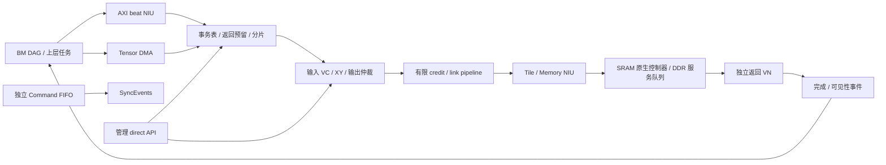

# 行为与时间责任

所有模型状态按实例隔离；SystemC 在每个 1ns 边沿推进。主机 wall time 单独记录。
本版 clock period 固定，cycles 可用于相对比较，频率变化不能直接代表已建模 DVFS。

## 数据路径

`Model::submit` 校验 source/context、地址加法、全范围映射、权限、payload/mask、
Tile token。拒绝无副作用；RETRY 不接受请求。成功后复制 payload 与身份，分配永不复用
的进程内 handle 和 epoch，预留 tracker/完整 read 返回字节。未消费 completion 占
tracker/返回资源。同 source/context/op/id 串行发出，read/write 独立；不同 ID 可并发。
每个外部事务最多 fragment_window 个片段在途（默认1，上限64），每周期最多注入一片。
读请求在发出任何片段之前预留整个 length 的返回存储；write ACK 元数据由有限 pending 表承载。
片段按 offset 重组和去重，不能凭最后一片到达就认为全部完成。DMA 独立、不重叠的子事务
通过 ordered=false 并发，外部 AXI 保持 ordered=true。同 source/context 的 fence 覆盖已接受子事务，
但不覆盖尚未送入总线的 DMA 工作，系统 fence 必须先等待 DMA 任务终态。

片段不跨 4KB，payload <= packet_bytes。head 记 16B，掩码记 ceil(payload/8)，
向当前通道宽度向上取整为 flits。packet_bytes 是 payload 上限而非含头总 flit 上限。
REQ/WRITE/RDATA/RESP 各自隔离 VC；split 模式是窄 REQ、共享宽 WRITE+RDATA、窄 RESP
三个物理通道。没有把三个通道伪装为同等 wire budget；PPA 未建模。

每 router 的每 input port/VC 有 depth 个 flit 槽。VC packet owner 从 head 获得至
该输入 tail 被消费释放；每物理 input/output 每周期至多一个 flit。
输出使用 RR；下一跳仅 XY。不足 credit 不发，credit 在真实出队后延迟归还。
每周期断言：`free_credit + queued + forward_inflight + returning_credit == depth`。
router_latency、link_latency 和 credit_latency 分别由输入就绪、前向管线、反向 credit
负责。头/掩码/填充收费，data 每跳收费；本地 loopback 不冒充网络 link bytes。
centralized 是一个全局共享、单 flit/cycle 的分析基线，不代表分层 crossbar。

目标在 head 到达时预留 slots（覆盖组包、排队、服务、等待响应注入）；tail 到达后
DDR backend 以 `ceil(bytes/bytes_per_cycle)` 占用共享读写服务带宽，独立叠加 read/write latency，
方向切换另占 turnaround_cycles；排队与响应占 slots。SRAM backend 直接走已有模型的
submit/push_w/pop，bank/读写争用与反压由该模型负责，不再收 DDR 延迟。细节见 memory.md。
目标可见后响应仍须经过网络，收到全部片段终态后才 TASK_DONE。SRAM 以 native B 或最后 R
消费作为保守的可见观察点。所有源访问同一实际存储；仅支持 Normal memory。

## 生命周期

FENCE 覆盖同 source/context 已接受水位，等待先前终态；历史失败使其返回失败。
它不提供 CPU cache coherence；domain 目前为整个 source/context，粒度比独立 order_domain 保守。
无多 Tile 全局有序承诺。只有完成消费者才能释放 tracker，外部不消费则 drain 不会成功。

reset 停止准入、推进 epoch、失效 token、清 NoC/未提交目标队列。已被原生 SRAM 接受的 AW
必须继续提供完整 W，并消费 B/R 后才终结为 ABORTED/uncertain；不调用会清存储的 SRAM reset。
超时同样先停新分片，再排空已发资源后返回 TIMEOUT_UNCERTAIN。外部永久不服务时不能承诺
有限时间完成。已发生写不回滚/重放，completed_ranges 记录已确认可见的片段，bytes 为其长度之和。
错误 read 的 data 清零；范围计数表示目标服务成功，不代表错误读向消费者发布了有效数据。
drain 计入 backend native/credit 尾部排空，全部完成且 completion 被消费后才可 resume。
map 更新要求 blocked+idle、服务配置不变、无 pinned token，并失效旧 reservation。

DMA 接收前检查所有 segment，重叠源/目的拒绝；成功复制描述符并 pin 目标 token。
每 job 最多 dma_window 个数据块并发，每块最多 max_transfer 字节；连续相同 source/length
的 segment 分为一组，每片源数据读取一次后向全部目的发出，再释放片缓存。多个组按描述符
顺序执行；组内目的重叠拒绝，不能把有依赖的 SG 重排为并发。
取消/首错停止新读写，但排空全部已接受子事务后才释放 token；复位 epoch 变化取消现有 DMA。
bytes_per_destination 和 completed 位图保留各目的已知效果，uncertain 从子事务传播。

## 计数口径

useful_bytes 为成功目标服务的逻辑字节（含 mask 禁用位置，非真实写使能字节）；
link_bytes 为所有跨 router 物理传输字节，含头/掩码/填充和请求/响应；
injected_bytes 包括本地 loopback。header_bytes/mask_bytes 仅计注入，不能直接从多跳
link_bytes 中减去。stall 是候选仲裁被阻塞的次数，不是所有停顿时钟的并集。
trace 目前记录 NIU/目标/完成阶段；计数器为 64-bit 主机计数，无 CSR wrap/snapshot ABI。

`ports.tsv` 按 router/output/VN 导出 flit/byte 与 credit/allocation/endpoint 阻塞计数；
output 0/1/2/3/4 分别为 E/W/S/N/Local（集中模式 output0 为共享总线）。
所有非 Local output 的 byte 求和必须等于 link_bytes；每物理输出每周期发送数上界单独核对。

