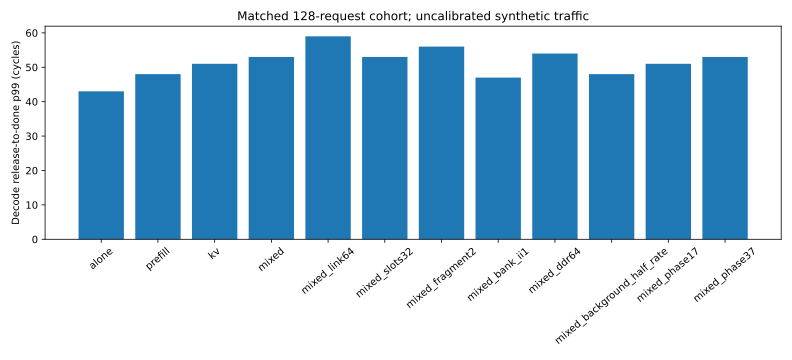

# Decode interference baseline

Same 128 Decode requests in every case. Nearest-rank percentiles; finite cohort, not a steady-state or probabilistic QoS guarantee.
Decode releases: [4096, 12288), period 64; background releases: [3072, 12288). All completions are included in cohort latency, including drain.
Initialization is identical and checked complete before background starts. Background address-slot reuse is completion-dependent; offered rate does not bypass backpressure.
Prefill is synthetic SRAM writes; KV is DDR-to-SRAM copy. These are bus traffic surrogates, not full NPU inference.

| Case | p50 | p95 | p99 | p99/alone | Decode B/cycle in release window |
|---|---:|---:|---:|---:|---:|
| alone | 43 | 43 | 43 | 1.000 | 4.000 |
| prefill | 43 | 48 | 48 | 1.116 | 4.000 |
| kv | 43 | 50 | 51 | 1.186 | 4.000 |
| mixed | 44 | 53 | 53 | 1.233 | 4.000 |
| mixed_link64 | 43 | 57 | 59 | 1.372 | 4.000 |
| mixed_slots32 | 44 | 53 | 53 | 1.233 | 4.000 |
| mixed_fragment2 | 44 | 49 | 56 | 1.302 | 4.000 |
| mixed_bank_ii1 | 41 | 47 | 47 | 1.093 | 4.000 |
| mixed_ddr64 | 44 | 54 | 54 | 1.256 | 4.000 |
| mixed_background_half_rate | 44 | 48 | 48 | 1.116 | 4.000 |
| mixed_phase17 | 44 | 51 | 51 | 1.186 | 4.000 |
| mixed_phase37 | 44 | 53 | 53 | 1.233 | 4.000 |

checks.json stores per-stage distributions, top router/output/VN stall counters and native SRAM counters. Stage means add; percentile values do not.
Request/response transport includes network queueing. Target timing combines adapter wait and native service. Stall counters are aggregate whole-run events across resources, not additive Decode cycles.
The half-rate case changes background workload explicitly; phase cases shift only background releases; resource probes keep mixed workload identical. Ratios use the original alone configuration, not a separate alone baseline for each resource variant. No PPA/RTL calibration or QoS mechanism is claimed.
