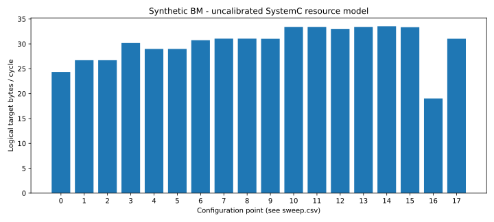

# SRAM/DDR 接入与 NIU/DMA 并发验证

日期：2026-09-24。实现基于 ESL revision `153d0b416db5` 加未提交修改；精确代码身份见
[checks.json](checks.json) 的 source_sha256，验证与扫描指纹一致。本报告替代旧基线对
存储端接入和片段并发的能力说明；原契约与 wenwang-edgenpu 未修改。

## 本轮实现

- Memory/Tile endpoint 可选原生 `npu_sram_controller`，实际走其 AW/W/R/B、Mapper、
  bank 仲裁和有限队列；数据只有一份，未叠加旧 DDR 延迟。DDR 明确建模读写共享带宽、
  读写延迟、方向切换与有限 endpoint slots。
- NIU 支持 fragment_window=1..64，按片段 offset 收集返回；完整读缓冲预留包含尚未取走的
  completion。外部同 ID 保序，DMA 独立子块允许重叠。
- DMA 支持 dma_window=1..64、大于 max_transfer 的逐片组播。同一源块只读一次，再 fanout
  到各目的；所有已接收子请求排空后才完成或释放 token。部分失败按目的返回已知成功字节。
- 取消、超时与 Mesh reset 停止新注入；已被 SRAM 接受的写继续送 W 并排空响应，随后返回
  失败/abort。存储效果不会回滚。错误片段内不确定的写标记 uncertain。

具体配置、接口边界和适配成本见 [存储与并发说明](../../docs/memory.md)。

## 验证证据

- [44 个 SystemC CTest](ctest.txt)：30 个 Mesh（含新增13个存储/并发用例）和14个原生 SRAM。
  覆盖 bank 冲突、读写切换、跨4KB与稀疏 mask、窗口吞吐、8KB大组播、部分失败、取消、
  reset、慢目的端/token 生命周期、未消费返回预留、原生写超时排空。
- [37 个 Mesh Python 测试](pytest.txt)；[CLI/布局/Mesh/SRAM 合计80项](python_compatibility.txt)通过。
- mixed、prefill、decode、hotspot、kv_migration、multicast、multicast_large 七类 BM 的
  读返回及最终存储与独立 Python 字节 oracle 一致；检查资源界限、完成/字节守恒与 DMA 源读取次数。
- 独立源码消费者及安装包搬迁消费者均实际访问 SRAM endpoint；双实例隔离检查通过。
- [18点扫描检查](sweep_checks.json)全部通过；[make check](workflow_check.txt)和
  [pre-commit](precommit.txt)通过。上述验证是功能/性能自洽证据，不是 RTL 校准。

## 大组播参数实验

使用 `configs/sram_ddr.yaml`，4×2 Mesh、256-bit link、256B packet。四个8KB源任务，
每个双目的；包括初始化、DMA读取/双写和读回，目标逻辑总数据196608B。
吞吐定义为逻辑目标访问字节/全批完成周期，包含 fill/drain 与验证流量，不是 NPU 有效计算吞吐。

| 点 | NIU/DMA 窗口 | 其他变化 | cycles | 逻辑 B/cycle |
|---|---|---|---:|---:|
| 0 | 1/1 | SRAM 8 banks，16 endpoint slots | 8074 | 24.351 |
| 7 | 4/2 | 同上 | 6331 | 31.055 |
| 10 | 8/2 | 同上 | 5883 | 33.420 |
| 11 | 8/4 | 同上 | 5883 | 33.420 |
| 12 | 8/4 | SRAM 4 banks | 5953 | 33.027 |
| 14 | 8/4 | SRAM 16 banks | 5861 | 33.545 |
| 15 | 8/4 | SRAM dual_port + dual_ingress | 5893 | 33.363 |
| 16 | 8/4 | 所有 endpoint slots=2 | 10330 | 19.033 |
| 17 | 8/4 | DDR turnaround=16 | 6334 | 31.040 |

窗口1/1→8/2使本批次周期减少27.1%、吞吐增加37.2%。DMA窗口4没有进一步收益，
因为单任务8KB在max_transfer=4KB时只有两个源块；这不是所有工作负载的饱和结论。
16-bank 对8-bank收益很小，说明本场景继续增加bank不足以显著改善系统瓶颈；端点slots缩到2
则明显退化。双端口或更大窗口也不保证混合系统单调加速，竞争顺序可能改变。
完整18点见 [CSV](sweep.csv)，逐点原生 bank/queue 指标保存在原始 run 的 target-N.json。
没有面积/功耗模型，不能把最高吞吐点称作成本最优配置。

## 复现与适用边界

从仓库根运行 `tools/esl_cli.py npu-mesh validate --config models/npu_mesh/configs/sram_ddr.yaml
--output <new-dir>`；专项扫描将 `validate` 换成 `memory-explore`。
原始输出：`runs/mesh-memory-validation-final` 和 `runs/mesh-memory-sweep-final`，包含
配置、工作负载、完整target指标、trace、内存快照与构建日志。本目录归档检查摘要与指纹。

SRAM仍为已有模型的支持子集：128B原生beat适配会引入边缘padding访问；region-holes/scrub
未接入。DDR为显式排队/带宽模型，没有DRAM row/rank/refresh时序。Mesh reset支持排空原生
存储，但 AXI frontend 自身非空复位尚未扩展。QoS、CDC/DVFS、真实BM trace、PPA与RTL校准
仍见 [差距清单](../../docs/gaps.md)。可以据此开展相对架构寻优，绝对周期误差尚未量化。
