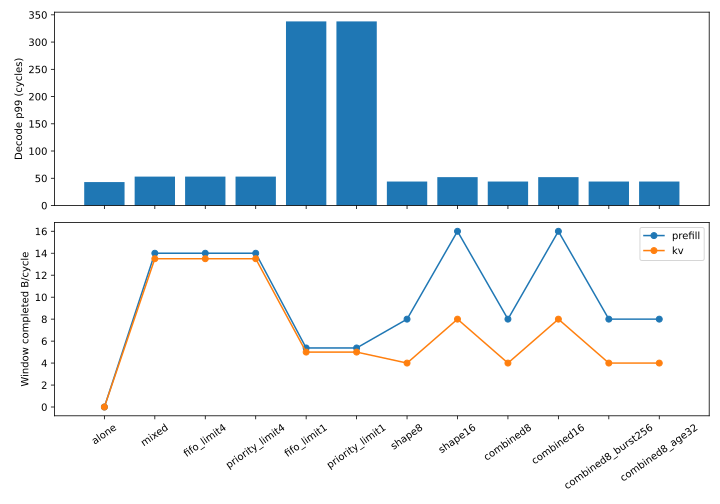

# NIU 整形与 SRAM 入口 QoS：实现和取舍

2026-09-24，SystemC full_data资源模型，未标定。完成NIU逻辑字节令牌桶、SRAM入口
优先context/老化选择和可配置原生在途上限。没有更改Router RR和原生bank内部仲裁。
配置合同见[QoS说明](../../docs/qos.md)，精确源码见[验证指纹](checks.json)。

## 实际效果

12点主扫描外加1个老化阈值诊断。除独占点外，输入文件hash完全相同：128个Decode、
288个Prefill写、72个KV复制及9个初始化事务。任何整形配置都没有删掉背景任务。
固定[4096,12288)窗口统计成功交付字节；全部任务最终排空并与独立字节oracle核对。
KV有效吞吐只计目的字节；其源读和目的写均使用令牌，所以8B/cycle桶通常对应约4B/cycle KV交付。

| 场景 | Decode p99(cycles) | Prefill窗口 B/cycle | KV窗口 B/cycle | 全批结束cycle |
|---|---:|---:|---:|---:|
| Decode独占 | 43 | — | — | 12269 |
| 混合，无QoS | 53 | 14.0 | 13.5 | 24032 |
| FIFO，原生在途上限4 | 53 | 14.0 | 13.5 | 24032 |
| 优先context1，原生在途上限4 | 53 | 14.0 | 13.5 | 24032 |
| FIFO，原生在途上限1 | 338 | 5.375 | 5.0 | 44696 |
| 优先context1，上限1，age128 | 338 | 5.375 | 5.0 | 44696 |
| **诊断：优先context1，上限1，age512** | **92** | 5.25 | 4.5 | 44696 |
| 每背景source/context 8B/cycle | 44 | 8.0 | 4.0 | 76715 |
| 每背景source/context 16B/cycle | 52 | 16.0 | 8.0 | 39915 |
| 8B/cycle + 优先入口上限4 | 44 | 8.0 | 4.0 | 76715 |
| 16B/cycle + 优先入口上限4 | 52 | 16.0 | 8.0 | 39915 |
| 8B/cycle组合，burst1024→256 | 44 | 8.0 | 4.0 | 76811 |
| 8B/cycle组合，age128→32 | 44 | 8.0 | 4.0 | 76715 |



**8B/cycle整形明显保护Decode，但成本很高。** p99从53降到44（接近独占43），全批时间
延长到约3.19倍，背景交付也降低。不能把Decode收益表述为无代价改善或推荐默认开启该限制。
16B/cycle只将p99降1cycle，当前实验不足以推荐它。source/context桶彼此独立，增加活跃流数量
会增加聚合注入，现模型尚无全局配额。

**入口优先级需要有可选择的等待请求。** 上限4时没有测得其增益；只把上限缩至1反而制造
严重瓶颈。age128时老化背景请求覆盖优先级，age512单变量诊断将p99由338降至92，说明
优先机制能改变尾延迟，但仍明显差于原始无QoS的53；这不是合理的并发压缩方案。
长老化阈值进一步偏向Decode，可能损害背景等待上界，不能用本有限任务集证明无饥饿保证。

下一步应保持足够存储并发，探索更适度的整形速率/突发和共享配额，再按真实热点需要细化
bank内部服务区分。Router加权仲裁应单独对照。要评估1.5×目标，还需负载强度、源目的位置、
相位、bank映射矩阵及RTL校准；当前包含上限1退化点，明确不具备全参数的端到端保证。

## 正确性与资源约束

- 49个CTest（35个Mesh含5个新增QoS微基准，14个原生SRAM）通过，见[日志](ctest.txt)。
  覆盖token限速/豁免、复位后恢复、FIFO、优先选择及老化请求按原始到达顺序覆盖优先级。
- [51个Mesh Python检查](pytest.txt)、[94项共享兼容性检查](python_compatibility.txt)通过。
- 七类既有BM、独立源码消费者、搬迁安装消费者通过；[make check](workflow_check.txt)和
  [pre-commit](precommit.txt)通过。
- 所有探索点通过真实读返回/最终存储oracle、字节守恒、有限资源界限和Decode阶段检查。
  启用整形的完整背景任务共收费884736B；逐source/context、逐注入事件复算token bucket，
  没有超额注入。默认关闭QoS仍复现原始独占43/混合53周期p99。
- FIFO和优先策略对照具有相同issue_limit；令牌只在Network::inject成功后扣除，
  原生已接受的AW/W/R/B不抢占、不回滚；没有额外叠加存储延迟。

12点明细见[qos.csv](qos.csv)及[机器可读结果](qos_checks.json)；补充诊断见
[age512检查](age512_checks.json)和[实际配置](age512_config.json)。所有证据源码指纹一致。
统计为nearest-rank的128个固定样本，包含窗口后完成的Decode，不代表稳态概率上界或真实NPU推理。

## 复现

从ESL仓运行：

```bash
python tools/esl_cli.py npu-mesh qos-explore --config models/npu_mesh/configs/sram_ddr.yaml --output runs/<new-dir>
```

诊断点用`npu-mesh run --config models/npu_mesh/reports/20260924-qos/age512_config.json
--workload runs/<main-dir>/mixed/workload.json --output runs/<new-diagnostic-dir>`。
原始结果位于`runs/mesh-qos-final2`、`runs/mesh-qos-age512-final`、`runs/mesh-qos-validation-final`，
包含每点配置、输入、trace、target/port指标和内存快照。实现未提交/发布，原总线契约及Wenwang项目未修改。
