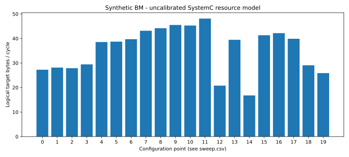

# 文王 NPU 总线 ESL 基线验证与 BM 扫描

日期：2026-09-24。依据：用户提供 `contracts/npu_mesh_axi_bus.md` 提议稿；BM 已确认为
benchmark 合成工作负载。实现位于 `models/npu_mesh`，未修改或冻结 wenwang-edgenpu 的
正式 OR–DR、架构参数或总线原始契约。开发基于 ESL 仓库 revision `153d0b416db5`，包含
本轮未提交变更，精确源码身份以 [checks.json](checks.json) 的 SHA256 为准。

## 对四项目标的实际支持

| 用户目标 | 本轮可执行能力 | 结论边界 |
|---|---|---|
| 模块功能定位 | NIU/target/completion 时间 trace；router/output/VN 的流量和阻塞计数 | 可以定位当前建模模块与端口；不是 RTL 信号波形 |
| 行为仿真正确 | full_data；独立 Python 字节 oracle；AXI beat、DMA、token、错误/取消/复位用例 | 公布子集通过；完整 P0 尚未全部实现 |
| 性能大体正确 | 实际有限缓冲与逐 flit 流控、目标流水服务、解析容量/跳数/credit 校验 | 性能自洽通过，RTL/实测误差未知 |
| BM 架构寻优 | 六类合成场景、DAG 重放、20 点参数扫描、时延分位数与瓶颈计数 | 可开展相对敏感性实验；不推荐立即冻结唯一配置 |

## 实际验证

- SystemC 3.0.2、C++17；17 个 CTest 全部通过，见 [ctest.txt](ctest.txt)。
- 27 个 Python 输入/负向/oracle 检查通过，见 [pytest.txt](pytest.txt)。
- 源码消费者与安装包搬迁后的独立消费者均运行真实事务通过；双实例存储隔离通过。
- mixed、prefill、decode、hotspot、kv_migration、multicast 六类 BM 的读返回和最终全部内存
  与独立 Python oracle 一致，逐点检查终态、依赖、tracker、buffer、物理输出容量和字节计数。
- 20 个探索点全部成功且校验通过；参数与结果见 [sweep_checks.json](sweep_checks.json)、
  [sweep.csv](sweep.csv)。
- 共享 CLI/布局/新模型回归共 65 项通过；工作区 `make check` 与 `pre-commit run --all-files` 通过。

单链路微基准：64 个 256B packet，32B link、credit 延迟8时，depth=1/16 分别用
5761/712 ticks；depth=16、64B link 为456 ticks。对应编码字节严格核对，深缓冲流达
约25.89 B/tick（包含头/填充，约80.9%链路能力，包含有限批次开销）。
另穷举8×8源目的组合，实际 link bytes 等于 Manhattan 跳数乘编码字节。
这些是资源模型性质验证，不是物理设计时序签核。

## 混合流量结果

默认 4×2、两个 memory endpoint，各32 B/cycle、latency=8、8 slots；
64个256B写和64个依赖写完成的32B读，总目标逻辑数据18432B。全批次包含fill/drain。

| 点 | 配置变化 | 完成 cycles | 目标逻辑 B/cycle | Decode 类 release→done p99 |
|---|---|---:|---:|---:|
| 6 | 256-bit，共享链路，depth=8 | 464 | 39.724 | 350 |
| 7 | 256-bit，宽窄分离 | 427 | 43.166 | 313 |
| 10 | 512-bit，共享链路 | 407 | 45.287 | 293 |
| 11 | 512-bit，宽窄分离 | 383 | 48.125 | 269 |
| 12 | 256-bit，集中共享总线基线 | 887 | 20.780 | 761 |
| 14 | 256-bit，payload片段缩至64B | 1098 | 16.787 | 984 |
| 18 | 每个目标带宽减半 | 634 | 29.073 | 520 |
| 19 | 每个目标latency增加32 cycles | 712 | 25.888 | 598 |

512-bit宽窄分离较256-bit共享链路的本批吞吐高约21.1%，但它增加了物理位宽与通道，
没有面积/布线/功耗证据，不能称为等成本最优。memory 慢化明显限制端到端收益。
64B分片退化显著，原因包括本版NIU每事务仅一个片段在途，需先研究分片窗口化，
不能把保守模型的损失当成所有真实NIU都会出现的结论。

混合流在credit延迟增加后可能因仲裁/到达顺序改变而略快；因此仅在控制变量微基准中
断言预期趋势，不对一般混合网络强加单调性。Decode分位数包含依赖/准入等待；独跑
Decode不含相同写依赖，未验证契约的1.5×干扰目标。

## 未覆盖与下一步

[完整差距](../../docs/gaps.md)列出具体未实现项。优先事项：实际 SRAM/DDR 端点接入、
NIU片段并发窗口、QoS整形与服务保证、完整资源依赖论证，然后加入CDC/DVFS/局部复位、
CSR/IRQ/PMU与RTL校准。真实模型推理、数值质量、TTFT、真实BM trace、PPA均未由本轮证明。

可复现入口为 README 中 `esl npu-mesh validate/run/explore`。本次原始 run 目录：
`runs/mesh-validation-20260924-final` 与 `runs/mesh-sweep-20260924-final`；
其中保存每点 config/workload、run.json、ports/trace/completions、内存快照与构建日志。
本目录保存可纳入版本管理的检查指纹、测试摘要和扫描图表，不复制构建二进制。
