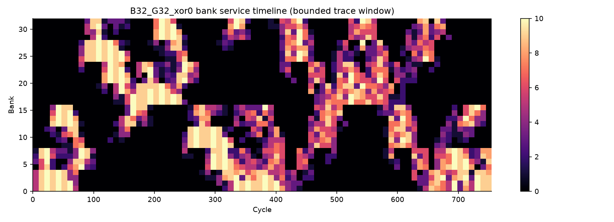
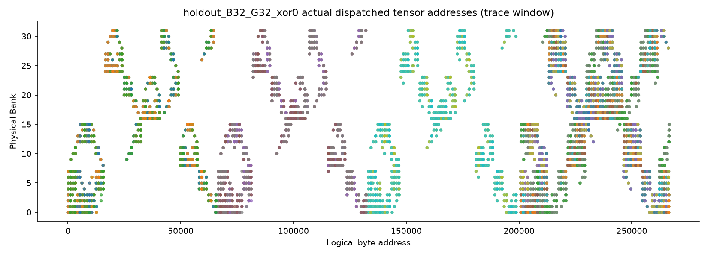
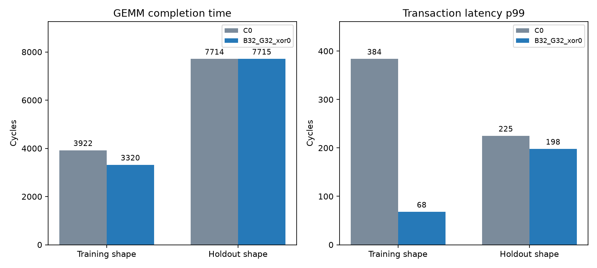
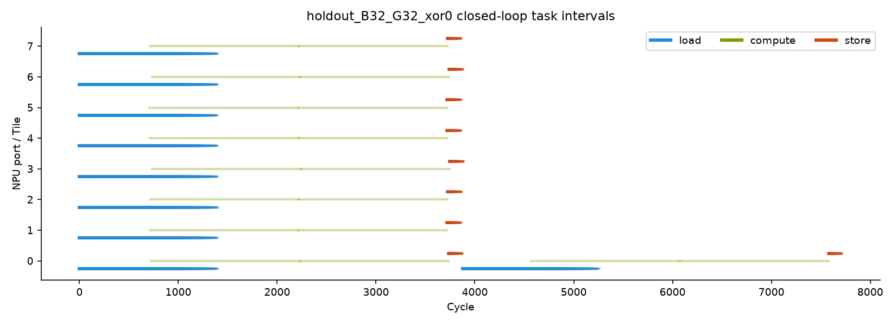

# 为什么 AI 特别适合 ESL 建模？

> 从 99.51% 的带宽到 0.318% 的系统收益：一次 NPU SRAM 架构探索

---

## 一、RTL 之前的问题，为什么要用 AI 来答？

芯片架构师每天都在回答这样一类问题：Bank 多一点有没有收益？地址交织选哪个粒度？网络要不要分层？Outstanding 加到多少会饱和？返回链路是不是瓶颈？

这些问题的答案，在 RTL 落笔之前就需要。但传统上有两条路，都不理想：**要么靠经验拍板**，风险是拍错方向、等到 RTL 做完才发现；**要么直接做 RTL 验证**，成本高、周期长，经不起试错。

ESL（Electronic System Level）建模本来就是为了这个问题而生的第三条路：在写 RTL 之前，用一套便宜、可信的模型，把架构选项系统地探索一遍。它不是新概念，但传统上一直很贵——建模、验证、探索每一项都耗人耗时，最后常常沦为"只能试两三个点"的摆设。

让 ESL 重新变得现实的关键，是 AI。AI 把建模、验证、探索的成本一起降了下来，ESL 才第一次有机会真正承担起"在 RTL 之前回答架构问题"的职责。这不是"重新做一遍 ESL"，而是**用 AI 把 ESL 做成它本该有的样子**。

为了讲清这件事，我们为 NPU 的共享 SRAM 控制器建了一个 SystemC 性能模型，跑了 1045 个配置点。结果得到两个形成鲜明反差的数据：

- 无冲突长流量下，有效读带宽 **1019.02 B/cycle，约理论峰值的 99.51%**——几乎满分；
- 但放到真实 NPU 负载上，系统级收益却**很有限**——保留集综合收益仅 0.318%。

一个带宽接近满分的方案，为什么在系统层面几乎没有收益？这个反差的背后，正藏着"用 AI 做 ESL"真正的价值。接下来我用这次探索，一层层讲清楚。

---

## 二、ESL 的本质是验证假设，而这正是 AI 擅长的事

先想清楚一件事：RTL 和 ESL 的目标根本不同。

RTL 的目标是**正确实现**——每个信号、每个时序都要精确无误。ESL 的目标则是**验证架构假设**——Bank 多一点有没有收益？XOR 映射值得吗？网络层次化划算吗？

验证假设，天然是一个循环：**提出假设 → 建模 → 实验 → 根据证据修正或证伪**。这个循环与 Agent/AI 的工作方式高度一致：AI 擅长提出检验方案、实现检验、并根据结果迭代。

而 ESL 的模型本身，恰恰是"参数化、可执行、可观测"的——AI 可以直接在这个循环里扮演"加速执行者"。

同样是 AI，用在 RTL 上的回报是"帮你写对"，用在 ESL 上的回报是"帮你试遍"。**ESL 的建模对象本身就是假设，而 AI 是执行假设的机器，两者天然匹配。**

---

## 三、AI 让模型从"能跑"变成"敢信"

一个"能跑"的模型很容易：SystemC 骨架、AXI 事务语义、Bank 映射，AI 很快就能生成初版。

但一个"敢信"的模型很难。这次探索的大部分精力，花在了模型可信度上：

- **地址映射不能靠"右移几位"**。AXI 一个 beat 是 128 字节，而 Bank word 只有 32 字节——一个 beat 要拆成多个 fragment 分发到不同 Bank，且 burst 不允许跨 4KB 边界。实现是逐字节计算物理位置、再按物理 word 聚合，并配套全地址空间的正逆映射双射测试。
- **反压必须端到端建模**。请求在网络上逐 hop 排队，Bank 有接收上限，回包要先凑齐完整 beat，credit 在端到端之间往返——而不是"带宽除以时间"的固定公式。
- **验证不能自说自话**。我们用一个独立于 SystemC 实现的参考计算做"对拍"：14 个 SystemC 单元用例、47 项 Python 回归、源码/安装/搬迁三种独立消费者，每次运行还附带守恒与容量上界检查。
- **一切必须可复现**。每次运行的配置、源码、工作负载都记录 SHA-256 哈希，同样的输入必然产生同样的结果。

这些能力本身都不算新。真正的问题在于，过去它们太贵了。

传统做法往往是：写模型占三成时间，补测试占七成，最后因为成本太高，只验证几个典型场景——模型停留在"研究脚本"的水平。而 AI 辅助之后，新增一个 Mapping / Queue / ECC 特性时，可以同步补上 oracle、边界用例、负向测试和回归。模型这才有机会从"研究脚本"升级为"工程资产"，足以支撑后续一千多次扫描。

所以这里有一条值得单独强调的观点：

> **AI 最大的价值之一，不是把模型第一版写得更快，而是让模型可以承担过去很难负担的"验证密度"。**

---

## 四、AI 让架构探索从"试几个点"变成"系统搜索"

过去，架构探索往往是这样的：*"我觉得 16 Bank 和 32 Bank 值得试一下。"*

现在，可以换成这样：**Bank × Interleave × Mapping × Topology × Queue × Outstanding × Return Bandwidth × Workload**，然后系统地搜索。这次探索就覆盖了 8–64 Bank 的组织方式、16–2048 B 的交织粒度、modulo 与四档 XOR shift、flat/hierarchical 拓扑、FIFO/VOQ、outstanding、返回带宽、ECC 与双端口对照。

当"多试一个架构点"的边际成本足够低，工程师的行为本身会改变。过去我们问："这个方案值不值得花两天验证？"现在更接近："既然模型已经有了，把整个空间扫掉。"

系统搜索还需要方法保障。我们有一个关键设计：**训练集负责选方案，保留集负责验证，且方案在跑保留集之前冻结**。保留集换了 shape、布局和随机 seed，相当于"考卷"和"练习题"严格分开，防止对着结果事后调参。

为什么不能靠经验试点？这次探索正好撞上了一个反例：

合成微基准（stream / stride / xor_adversary）优选出架构 B8_G2048_xor1——如果只看微基准，它是"考场状元"。可放到真实 NPU 负载上，它平均慢 **3.13%**、最坏慢 **26.67%**。如果只试经验上的几个点，我们很可能就选错了。用连续带宽微基准选架构，和只看高考分数招工程师一样不可靠——这正是报告的原话。

---

## 五、真正的价值：找到瓶颈在哪里，而不是只找最优参数

0.318% 只是一个数字。真正有价值的，是它引出的问题：**为什么？**

我们把同一个保留集 GEMM 从三个层面拆开看。

**第一层，存储层健康吗？** Bank 服务热力图显示没有热点，地址派发散点显示 XOR 映射把访问均匀地摊到了 32 个 Bank 上——存储这一侧既没有热点，也没有系统性冲突：

**第二层，事务层变快了吗？** 在这个 GEMM 上，99 分位延迟确实从 225 个周期降到了 198——事务确实变快了：

**第三层，系统层呢？** 任务时间线显示，大部分端口早早完成后，**port 0 仍在为后续 tile 串行执行 load / compute / store**——总时长被端口任务分配与计算关键路径卡住，根本不在 Bank：

三层合起来，是一条完整的因果链：

> **存储层健康 → 事务层变快 → 系统层没变快 → 关键路径在别处。**

于是结论变得清晰而克制：

- 在这个负载上，XOR 优化的对象（存储与事务层）**不是系统的瓶颈**，所以收益传不到总时长；
- XOR 在另一种场景下确实有效：训练 GEMM 的 A/B 行步长（1024 B）恰好对齐 modulo 交织周期（32×32 B），XOR 借此缓解了分派/前端压力，时长 3922→3320 cycles（约 −15.35%）；
- 但这种收益依赖具体 shape 与布局，没有稳定推广到保留集（换 shape 后 C0/XOR = 7714/7715，几乎无差）。

所以它适合作为**可配置能力保留**，而不是直接固化为唯一实现。同时，模型尚未完成 RTL / SRAM Macro 校准，这些结果用于**比较架构趋势**，而不是预测最终芯片指标。

但这一节真正想说的，比"XOR 行不行"更重要：

> 这场探索真正改变的，不是"SRAM 怎么优化"，而是下一步研发方向——**也许不应该继续优化 SRAM Controller**，而是去看端口任务分配与计算关键路径。

**好的 ESL 不只是帮你决定"怎么做"，更重要的是告诉你"这件事还值不值得继续做"。**而 AI 让"假设 → 模型 → 扫描 → 证据 → 新假设"这个闭环变得便宜，于是"换个方向"不再意味着推倒重来。

---

## 六、AI + ESL 的真正意义

回到最初的问题：为什么 AI 特别适合 ESL？因为 AI 把 ESL 的三种成本一起降了下来，而每一种，都对应前面一节的验证：

**1. 降低"建模"的成本**（对应第二节：AI 是执行假设的机器）。把架构想法快速变成可执行、可参数化的模型。

**2. 降低"证明模型可信"的成本**（对应第三节：验证密度）。测试、oracle、边界用例、回归与模型一起生长，模型从"研究脚本"升级为"工程资产"。

**3. 降低"探索"的成本**（对应第四节：系统搜索）。从几个经验点，变成成百上千个配置点的设计空间探索（Design Space Exploration，DSE）。

三者合起来，才让 ESL 能完成它最本分的工作：**在流片之前、在 RTL 完成之前，用足够多的证据回答"这个方向值不值得投入"。**

如果要用一句话总结：

> **RTL 阶段，AI 帮你更快地把设计实现出来；ESL 阶段，AI 帮你更早地发现哪些设计值得实现。**

最后仍要强调边界：抽象层级、假设边界、最终决策，始终在工程师手里。AI 把执行成本降下来，把判断留给人。这次的完整证据——模型源码、14 个用例、47 项回归、1045 次扫描——都保存在仓库里，可随时复现。

---

*本文基于仓库内真实交付的 NPU SRAM 控制器 ESL 性能模型与完整仿真记录，数据来自 [`reports/20260918/report.md`](../../reports/20260918/report.md)。模型为未校准资源模型，数字用于架构趋势比较，不构成芯片性能承诺。*
