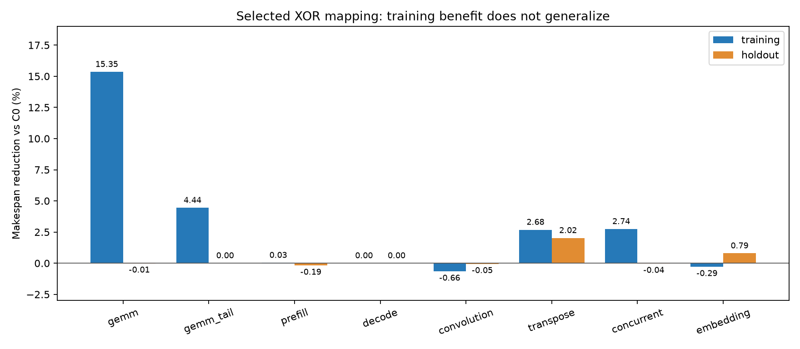

# NPU SRAM 性能模型：最终仿真与结果分析

本轮完成 **1045 次主扫描与 8 次仲裁对照，全部执行通过**。训练集选出的方案为 **B32_G32_xor0**：32 Bank × 32 B、32 B 交织、XOR shift=0、flat 网络、VOQ、RR、每端口 32 outstanding，容量 8 MiB；保持 C0 的队列与链路预算。其余参数保持 C0；XOR 映射为 `bank = (floor(address/32) % 32) XOR (floor(address/1024) % 32)`。这是有限候选集中的训练集优选，**未证明全局最优，也未达到整体 NPU 时长降低 10% 的目标**。

## 目标与结论

| 指标 | 目标 | 实际结果 | 判定 |
|---|---:|---:|---|
| 无冲突长流量有效读带宽 | ≥921.6 B/cycle，理论 1024 的 90% | 1019.02 B/cycle，约 99.51% | 达成 |
| NPU 八类负载等权几何平均时长 | 相对 C0 ≤0.90 | 训练 0.968282；保留集 0.996820 | 未达成 |
| 保留集最坏单负载退化 | ≤10% | 1.0204%，embedding seed 149 | 达成 |
| 推荐方案 buffer 容量代理 | ≤C0 的 1.25 倍 | 1.00 倍，3,866,624 bits | 达成 |
| 仿真执行与守恒检查 | 无失败点 | 主扫描 1045/1045；仲裁对照 8/8 | 通过 |

“时长降低”按 `1−候选时长/基线时长` 计算，不混用吞吐提升百分比。长流量测量包括启动与排空，是完整窗口吞吐；不是剔除预热后的稳态测量。执行通过不能解释为全部性能目标达成。

保留集综合收益仅 **0.318%**，不足以据此承诺普遍性能收益。随机 embedding 的五组配对 seed 时长比 95% 区间为 **[0.97554, 1.00889]**，包含 1。建议将 XOR 作为可配置映射方案保留；在没有 RTL 时序/面积校准和实际工作负载之前，不据此硬化为唯一映射。

## Benchmark 与搜索边界

主扫描包括 140 组 Bank/交织配置 × 3 个微基准 = 420 次，48 个架构 × 12 个训练实例 = 576 次，4 个冻结候选 × 12 个保留实例 = 48 次，以及 1 次长流量峰值检查。训练与保留集均有 GEMM、低并行 GEMM、prefill、decode、卷积、转置、DMA 并发和 embedding 八类；embedding 各用五个 seed，先在类内聚合，避免随机类因实例多而获得额外权重。

所有 NPU 流量通过实际存储完成反馈释放 DAG 依赖，包含有限 ping-pong buffer 生命周期和 compute/load/store 重叠。训练与保留集变更 shape、布局/stride 和随机 seed；训练 GEMM 为 256×128×128、tile 64×64×64；保留集为 192×192×128。训练/保留 embedding seed 分别为 11/23/37/53/71 和 101/127/149/173/199。没有执行数学 GEMM/Attention 数值计算，不能把流量守恒说成 NPU 数值正确。

主寻优空间包括 8/16/32/64 Bank 等总带宽组织，16–2048 B 七档交织粒度，modulo 与四档 XOR shift；再比较 flat/hierarchical、远端链路 64/128/256 B/cycle、FIFO/VOQ、outstanding、group/local XOR、region、返回带宽与 ECC/双端口对照。不是这些参数的完整笛卡尔积。综合选型只在无 ECC、1RW 家族内进行，约束训练最坏退化 ≤10%、buffer ≤1.25 倍；选择记录在保留集运行前冻结，保留集没有重新调参。

## 推荐方案逐类表现

下表为候选时长/C0，越低越好。C0 为 32 Bank × 32 B、32 B modulo 交织、flat/VOQ/RR。

| 负载 | 训练 | 保留集 |
|---|---:|---:|
| GEMM | 0.846507 | 1.000130 |
| GEMM tail | 0.955607 | 1.000000 |
| Prefill | 0.999686 | 1.001857 |
| Decode | 1.000000 | 1.000000 |
| Convolution | 1.006608 | 1.000549 |
| Transpose | 0.973154 | 0.979798 |
| Concurrent DMA | 0.972590 | 1.000359 |
| Embedding，五 seed 几何平均 | 1.002923 | 0.992072 |

训练 GEMM 的时长从 **3922 降至 3320 cycles（−15.35%）**，p99 从 384 降至 68 cycles，DAG 依赖等待累计量从 6153 降至 1343 tile-cycles。A/B 行步长 1024 B 恰好等于 32×32 B 的 modulo 周期；XOR 将更高地址位混入 Bank 选择，改变行间分布。结合地址映射图和等待指标，收益主要表现为分派/前端压力下降。

不能用 Bank 仲裁冲突计数单独判定好坏：这个 GEMM 中 C0 的 Bank 冲突为 0，而 XOR 为 3049；C0 请求已经在 Bank 之前受限，XOR 允许更多请求抵达 Bank。前端失败尝试数从 972431 降至 4432，但这是**尝试次数，不是周期数**；也不能将 DAG 依赖等待等同纯 memory stall。

保留 GEMM 改为 192×192×128、leading dimension 520，A/B 行步长 1040 B，自身打破原有 modulo 同余规律，且 tile 分配与计算关键路径改变：C0/XOR 分别为 **7714/7715 cycles**。虽然 p99 从 225 降至 198，算子时长没有改善。这是“改善访存局部指标不保证改善 NPU 总时长”的实际反例；shape 与 layout 同时改变，因此本轮不能将收益消失全部归因于 padding。

## 其他架构与仲裁结论

- 合成微基准优选 B8_G2048_xor1，在 NPU 训练集反而平均慢 **3.13%**，最坏慢 **26.67%**；transpose 慢 24.16%，embedding 类慢 24.51%。不能只用连续带宽微基准选架构。
- 同一粗粒度组织下，分层远端宽度 64/128/256 的训练时长比分别为 **1.251806/1.129782/1.101737**；加宽能够缓解限制，但多跳与布局不匹配仍有代价。
- 返回宽度降至 32 B/cycle 后，综合时长比 **1.178538**，prefill 达 **1.280044**。因此不能仅按 Bank 总带宽估算系统性能。
- B64_G16_xor0 训练比 0.972940，但 buffer 代理 4,947,968 bits，约 C0 的 **1.2797 倍**，超过预算；增加 Bank 不能当成免费收益。B16_G64_xor1 更省 buffer，但保留集综合比 1.001920，未优于 C0。
- 同 ECC 家族对照：ECC_B8_G2048_xor1 相对 C_ECC 综合慢 **2.713%**，最坏慢 **25%**，不推荐。ECC 报告与无 ECC 选型分开，不能跨可靠性等级宣称优胜。
- 四种仲裁在 concurrent 上的时长：RR **13608**、age **13624**、固定 2:1 weighted **13610**、read-first **13608 cycles**；embedding seed 11 均 **134 cycles**。当前两个负载没有显示换仲裁带来整体收益，也不能由此推出所有热点下公平性等价。

模型能处理同 Bank 访问竞争、有限队列反压、FIFO HOL、同 ID 同方向顺序、独立 AW/W 与 RMW 冲突。14 个 SystemC 用例覆盖映射双射、独立数据 oracle、精确 latency/II、返回反压、ECC、层次网络、保序、非法请求、reset、并发部分写、双端口、HOL 与 W-before-AW；源码/安装/搬迁三个独立消费者通过，Python 回归 47 项通过。RR 在本 NPU 流量中完成不等于任意场景的形式化公平性证明。

## 支撑图表与交付边界

图 1：正值表示总时长降低。GEMM 训练收益没有推广到保留集；收益取决于具体 shape、布局和执行依赖。

图 2：各阶段分别对同一负载比较 C0 与 XOR。保留集 p99 降低，整体时长仍基本不变；不能将局部延迟收益直接等同算子提速，也不能直接比较不同 shape 的训练与保留集绝对时长。

图 3：推荐方案保留 GEMM 的任务时间线。大部分端口完成后，port 0 仍有后续 tile 的 load/compute/store；端口任务分配与计算关键路径限制了总时长。横线是任务起止跨度，不表示该端口每一拍都在传输。

本目录交付综合结论和以上三张图，不提交自动生成的 JSON、YAML、HTML 或中间构建产物。验证摘要仅存放于本地已忽略的 `runs/`。模型、测试、工作负载生成器与扫描工具保留，支持按需重新生成全量结果和可视化。

从 workflow 根使用 [模型 README](../../README.md) 中的 CLI，选择新的 `--output` 目录复跑。需要 SystemC 3.0.2、C++17/CMake、现有 uv 根环境及 PyYAML/Matplotlib。最终整理仅调整报告归档和源码哈希的目录排除规则，没有改变主扫描的 SystemC 实现或工作负载；模型及独立消费者在整理后复验。

当前模型是未经过 RTL/实测校准的资源性能模型，direct AXI channel events 而非 pin-level VIP；每 ID 队头展开偏保守，ECC 为故障/资源抽象，本地 PE 端口争用、任意 WRR 表、多时钟等未覆盖。详见 [设计边界](../../docs/design.md)。buffer/switch 为容量与交换规模代理，不能代替综合面积、布线成本或频率。
